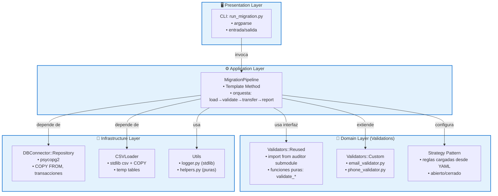
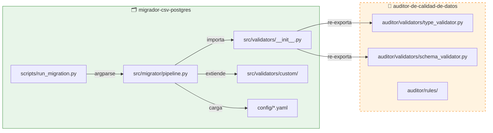
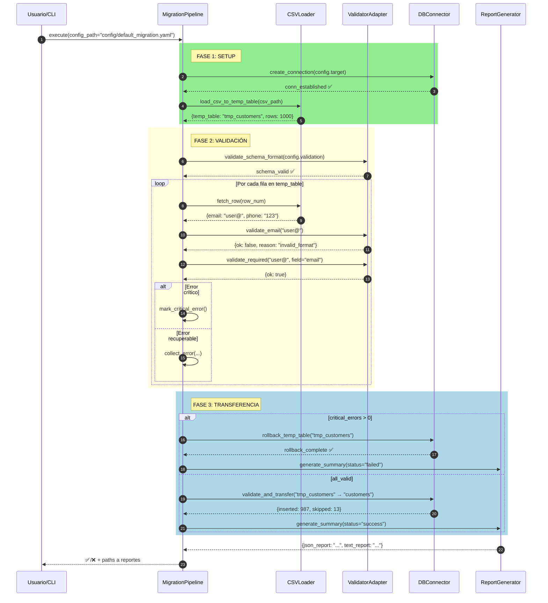
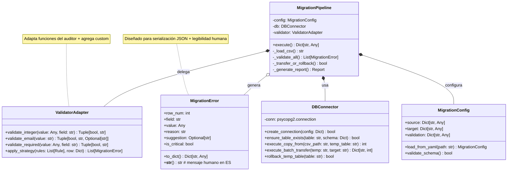

# Architecture Guidelines

## 🏗️ Patrones Arquitectónicos

### Clean Architecture Implementation

El proyecto sigue una arquitectura de capas limpia con inversión de dependencias:



### Matriz de Patrones

| Patrón | Componente | Implementación | Beneficio para MVP |
|--------|-----------|---------------|-------------------|
| **Strategy** | `validation_rules` en YAML | `if rule.type == 'email': apply_email_regex()` | Agregar reglas sin tocar pipeline |
| **Template Method** | `MigrationPipeline.execute()` | Pasos definidos: `_load() → _validate() → _transfer() → _report()` | Testing por etapa + extensibilidad |
| **Repository** | `DBConnector` | Interfaz: `ensure_table_exists()`, `execute_batch_insert()` | Cambiar DB engine sin tocar dominio |
| **Adapter** | `ValidatorAdapter` | Wrapper que unifica API del auditor + validadores custom | Reuso sin acoplamiento a implementación |

## 🏛️ Estructura de Capas

### 1. Presentation Layer
```
scripts/run_migration.py  # CLI principal
├── argparse parsing
├── env file loading
├── dependency injection
└── error handling
```

**Responsabilidades:**
- Parsear argumentos de línea de comandos
- Cargar variables de entorno
- Inyectar dependencias
- Manejar errores de alto nivel

### 2. Application Layer
```
src/migrator/
├── pipeline.py           # Orquestador principal (Template Method)
├── csv_loader.py         # Carga y validación CSV
├── db_connector.py       # Operaciones PostgreSQL
├── error_handler.py      # Manejo acumulado de errores
├── report_generator.py   # Generación de reportes
└── __init__.py
```

**Responsabilidades:**
- Orquestar el flujo de migración
- Coordinar componentes del dominio
- Generar reportes estructurados

### 3. Domain Layer
```
src/validators/
├── __init__.py          # Interfaz común
└── custom/              # Validadores específicos
    ├── email_validator.py
    ├── phone_validator.py
    └── __init__.py
```

**Responsabilidades:**
- Contener lógica de validación de negocio
- Definir reglas de dominio
- Mantener estado independiente de infraestructura

### 4. Infrastructure Layer
```
src/utils/
├── logger.py          # Logging estructurado
├── helpers.py         # Funciones auxiliares
└── __init__.py
```

**Responsabilidades:**
- Proporcionar utilidades compartidas
- Manejar logging estructurado
- Funciones auxiliares puras

## 🧩 Componentes Principales

### Integración con Submodule



> [!IMPORTANT]
> **Regla de integración**: El migrador **nunca** modifica código en `extern/auditor/`.  
> Para contribuir al auditor: fork → PR → actualizar submodule.

### Secuencia: Pipeline de Migración



### Clases Principales



## 📁 Estructura de Directorios

```
migrador-csv-postgres/
├── src/                     # Código fuente
│   ├── migrator/           # Lógica principal
│   │   ├── pipeline.py
│   │   ├── csv_loader.py
│   │   ├── db_connector.py
│   │   ├── error_handler.py
│   │   ├── report_generator.py
│   │   └── __init__.py
│   ├── validators/         # Validadores
│   │   ├── __init__.py
│   │   └── custom/
│   │       ├── email_validator.py
│   │       ├── phone_validator.py
│   │       └── __init__.py
│   └── utils/              # Utilidades
│       ├── logger.py
│       ├── helpers.py
│       └── __init__.py
│
├── config/                 # Configuraciones
│   ├── default_migration.yaml
│   ├── schema_examples/
│   │   ├── customers_schema.yaml
│   │   ├── products_schema.yaml
│   │   └── orders_schema.yaml
│   └── validation_rules/
│       └── email_phone_rules.yaml
│
├── scripts/                # Scripts de utilidad
│   ├── init_db.py
│   ├── run_migration.py
│   ├── run_schema.sh
│   ├── update_submodule.sh
│   ├── verify_setup.sh
│   └── sql/
│       ├── 01_create_database.sql
│       ├── 02_create_schema.sql
│       ├── 03_create_indexes.sql
│       ├── drop_database.sql
│       └── test_schema_operations.sql
│
├── test/                   # Tests
│   ├── conftest.py
│   ├── fixtures/
│   │   ├── valid_customers.csv
│   │   ├── invalid_customers.csv
│   │   └── test_schema.yaml
│   ├── unit/
│   │   ├── test_csv_loader.py
│   │   ├── test_error_handler.py
│   │   └── test_validators_reuse.py
│   └── integration/
│       ├── test_db_connector.py
│       └── test_migration_flow.py
│
├── docs/                   # Documentación
│   ├── ADR.md
│   ├── ERD.md
│   ├── POSTGRES_SETUP.md
│   ├── REUSE_STRATEGY.md
│   └── TROUBLESHOOTING.md
│
├── extern/auditor/         # Git submodule (read-only)
├── .agent-instructions/    # Documentación para agentes
├── AGENT.MD               # System prompt para agentes
├── README.md              # Documentación principal
├── CONTRIBUTING.MD         # Guía de contribución
├── CHANGELOG.md           # Historial de cambios
├── requirements.txt       # Dependencias runtime
├── requirements-dev.txt    # Dependencias desarrollo
├── docker-compose.yml     # Configuración Docker
└── .env.example           # Ejemplo de variables de entorno
```

## 🎯 Contextos Específicos

### Cuando Modificar `src/migrator/pipeline.py`
- Mantener Template Method pattern
- No agregar lógica de negocio específica
- Preservar inyección de dependencias
- Mantener rollback transaccional

### Cuando Agregar Validadores
- Crear en `src/validators/custom/`
- Implementar interfaz común
- Registrar en configuración YAML
- Agregar tests unitarios

### Cuando Modificar CLI
- Mantener argparse simple
- No agregar lógica de negocio
- Preservar manejo de errores
- Mantener --dry-run y --verbose
