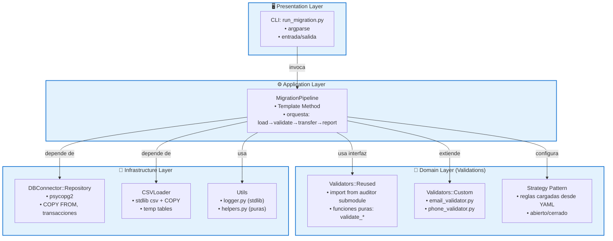
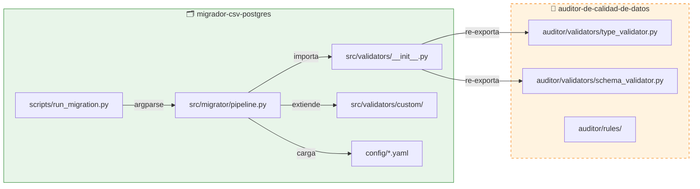
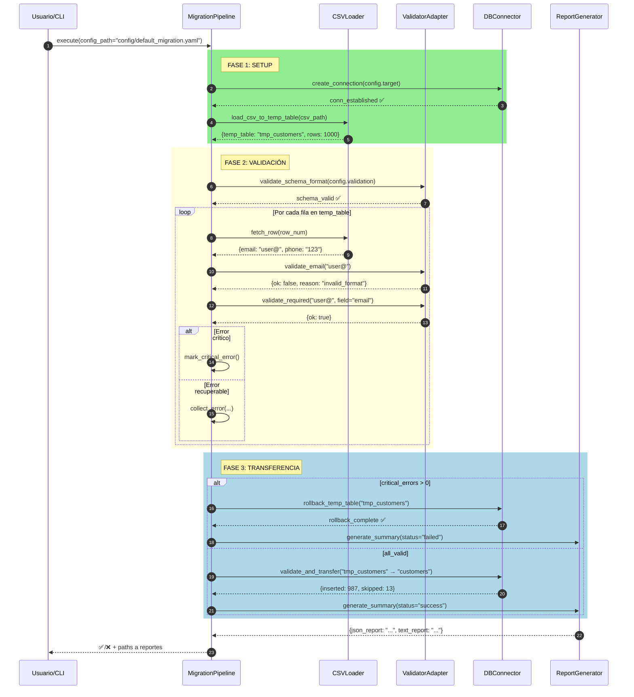
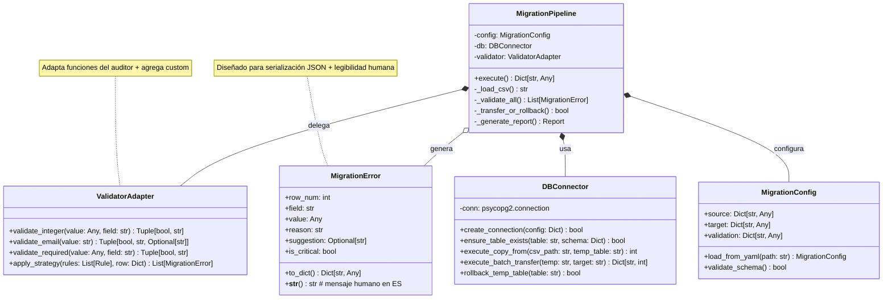
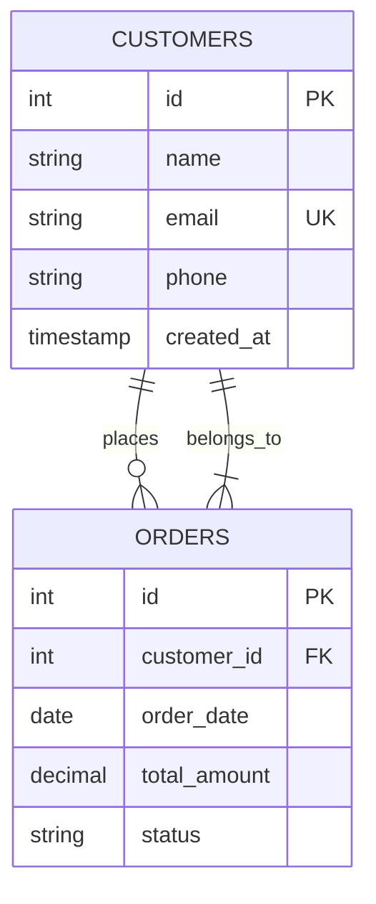

# 🗂️ Migrador CSV → PostgreSQL con Validación Reutilizable
*Documentación modularizada para Cascade*

```yaml
# Frontmatter: Metadatos estructurados para procesamiento automático
project:
  name: "migrador-csv-postgres"
  version: "0.1.0-mvp"
  status: "planning"
  created: "2026-04-15"
  updated: "2026-04-16T01:23:00Z"
  duration_estimate: "40-60h"
  
dependencies:
  external:
    - name: "auditor-de-calidad-de-datos"
      type: "git_submodule"
      url: "https://github.com/Fisherk2/auditor-de-calidad-de-datos"
      integration: "import_functions"
      constraint: "read_only"
  
  python:
    runtime: ["psycopg2-binary>=2.9", "pyyaml>=6.0"]
    dev: ["pytest>=7.0", "pytest-cov>=4.0", "black>=23.0"]
  
  database:
    engine: "postgresql>=14"
    schema: "e-commerce-mvp"
    
context:
  domain: "e-commerce"
  tables: ["customers", "products", "orders"]
  language:
    errors_human: "es"
    logs_tech: "en"
    
architecture:
  pattern: "layered_clean_architecture_lite"
  principles: ["SOLID", "DRY", "dependency_inversion"]
  layers:
    - name: "presentation"
      component: "CLI"
      tech: "argparse"
    - name: "application" 
      component: "MigrationPipeline"
      pattern: "template_method"
    - name: "domain"
      components: ["Validators::reused", "Validators::custom"]
      pattern: "strategy"
    - name: "infrastructure"
      components: ["DBConnector", "CSVLoader"]
      pattern: "repository"
```

---

## 🎯 1. Propósito y Alcance (MVP)

> [!SUMMARY]
> **Objetivo**: Herramienta CLI que migra datos CSV → PostgreSQL reutilizando validadores del proyecto `auditor-de-calidad-de-datos`, generando reportes de errores accionables.

**Entrada**: Archivos CSV con datos de customers/products/orders  
**Proceso**: Validación tipada + reglas de negocio + ingesta atómica  
**Salida**: Datos en PostgreSQL + reporte JSON/texto con errores y sugerencias

**Criterios de éxito MVP**:
- [ ] ✅ Migración de 1000 filas en <5 minutos
- [ ] ✅ Reuso funcional de 3+ validadores del auditor
- [ ] ✅ Reporte con conteo: importados/rechazados + sugerencias
- [ ] ✅ Rollback automático ante errores críticos
- [ ] ✅ Cero dependencias no-open-source

---

## 📋 2. Requisitos Modularizados

### 2.1 Requisitos Funcionales (RF)

| ID | Módulo | Descripción | Criterio de Aceptación | Prioridad |
|----|--------|-------------|----------------------|-----------|
| **RF-001** | `csv_loader` | Ingesta eficiente vía `COPY FROM` | Temp table creada con encoding UTF-8 validado | 🔴 Alta |
| **RF-002** | `validators::reused` | Reuso de `validate_integer`, `validate_email` | Errores incluyen `row_num` y `field_name` | 🔴 Alta |
| **RF-003** | `validators::config` | Validación de campos obligatorios vía YAML | Mensaje: "Campo X requerido en fila Y" | 🔴 Alta |
| **RF-004** | `validators::custom` | Regex email (RFC 5322 simplificado) + teléfono | Sugerencia: "¿Quisiste decir user@domain.com?" | 🟡 Media |
| **RF-005** | `report_generator` | Reporte dual: JSON machine-readable + texto humano | Incluye: `{imported: N, rejected: M, errors: [...]}` | 🔴 Alta |
| **RF-006** | `db_connector` | Transacción atómica con rollback seguro | Log: "Rollback ejecutado: [motivo]" | 🔴 Alta |
| **RF-007** | `cli` | Flags: `--config`, `--dry-run`, `--verbose` | `--dry-run` no modifica BD, solo valida | 🟡 Media |
| **RF-008** | `config_loader` | Carga y validación de schema YAML al iniciar | Error claro si YAML no cumple schema esperado | 🟡 Media |
| **RF-009** | `tests::integration` | Fixtures: CSV válidos/inválidos + verificación de conteo | pytest pasa con BD de prueba en Docker | 🔴 Alta |
| **RF-010** | `docs::reuse` | `REUSE_STRATEGY.md` con comandos de submodule | Onboarding: nuevo dev puede extender validadores en <1h | 🟢 Baja |

### 2.2 Requisitos No Funcionales (RNF)

| ID | Categoría | Especificación | Métrica de Verificación |
|----|-----------|---------------|------------------------|
| **RNF-001** | Performance | <5 min para 1000 filas | `time run_migration.py --config ...` |
| **RNF-002** | Licencias | 100% dependencias permisivas (MIT/BSD/Apache) | `pip-licenses --format=markdown` |
| **RNF-003** | Observabilidad | Logging estructurado: `INFO` para flujo, `ERROR` con contexto | Logs parseables por `jq` |
| **RNF-004** | Acoplamiento | Imports explícitos del auditor; sin herencia cruzada | `grep -r "from auditor" src/` muestra solo funciones |
| **RNF-005** | Internacionalización | Errores humanos en ES, logs técnicos en EN | `grep "Error:" logs/` vs `grep "Error:" report_*.txt` |

---

## 🏗️ 3. Arquitectura: Patrones y Capas

### 3.1 Diagrama de Capas (Mermaid)



### 3.2 Matriz de Patrones

| Patrón | Componente | Implementación | Beneficio para MVP |
|--------|-----------|---------------|-------------------|
| **Strategy** | `validation_rules` en YAML | `if rule.type == 'email': apply_email_regex()` | Agregar reglas sin tocar pipeline |
| **Template Method** | `MigrationPipeline.execute()` | Pasos definidos: `_load() → _validate() → _transfer() → _report()` | Testing por etapa + extensibilidad |
| **Repository** | `DBConnector` | Interfaz: `ensure_table_exists()`, `execute_batch_insert()` | Cambiar DB engine sin tocar dominio |
| **Adapter** | `ValidatorAdapter` | Wrapper que unifica API del auditor + validadores custom | Reuso sin acoplamiento a implementación |

---

## 🧩 4. Diseño: Componentes y Flujos

### 4.1 Integración con Submodule



> [!IMPORTANT]
> **Regla de integración**: El migrador **nunca** modifica código en `extern/auditor/`.  
> Para contribuir al auditor: fork → PR → actualizar submodule.

### 4.2 Secuencia: Pipeline de Migración



### 4.3 Clases Principales (Simplified)



---

## 🌐 5. Dominio: Entidades y Relaciones

### 5.1 Esquema E-Commerce (MVP)

```sql
-- customers
CREATE TABLE customers (
    id SERIAL PRIMARY KEY,
    name VARCHAR(100) NOT NULL,
    email VARCHAR(255) NOT NULL UNIQUE,
    phone VARCHAR(20),
    created_at TIMESTAMP DEFAULT CURRENT_TIMESTAMP,
    updated_at TIMESTAMP DEFAULT CURRENT_TIMESTAMP
);

-- products  
CREATE TABLE products (
    id SERIAL PRIMARY KEY,
    name VARCHAR(200) NOT NULL,
    description TEXT,
    price DECIMAL(10,2) NOT NULL CHECK (price >= 0),
    stock_quantity INTEGER NOT NULL DEFAULT 0 CHECK (stock_quantity >= 0),
    is_active BOOLEAN DEFAULT true
);

-- orders
CREATE TABLE orders (
    id SERIAL PRIMARY KEY,
    customer_id INTEGER NOT NULL REFERENCES customers(id),
    order_date DATE NOT NULL DEFAULT CURRENT_DATE,
    total_amount DECIMAL(10,2) NOT NULL CHECK (total_amount >= 0),
    status VARCHAR(20) NOT NULL DEFAULT 'pending' 
        CHECK (status IN ('pending', 'processing', 'shipped', 'delivered', 'cancelled'))
);
```

### 5.2 Entidades de Infraestructura

| Entidad | Propósito | Campos Clave | Persistencia |
|---------|-----------|-------------|-------------|
| `MigrationLog` | Auditoría del proceso | `id`, `timestamp`, `csv_file`, `target_table`, `status`, `error_count` | PostgreSQL (tabla `audit.migration_logs`) |
| `ValidationError` | Errores accionables | `row_num`, `field`, `invalid_value`, `reason`, `suggestion`, `is_critical` | Memoria → JSON/CSV (no se persiste en BD) |
| `ValidationRule` | Reglas configurables | `field`, `type`, `params`, `error_message`, `suggestion_template` | YAML en `config/validation_rules/` |

### 5.3 Cardinalidades (MVP Scope)



> [!NOTE]
> **Alcance MVP**: Migramos `customers`, `products`, `orders` de forma independiente.  
> La relación `Order`↔`Product` (N:M) requiere tabla `order_items` → **Fase 2**.

---

## 📁 6. Estructura de Ficheros (Modular)

```
migrador-csv-postgres/
├── 📦 metadata/
│   ├── project.yaml          ← Frontmatter consolidado (para herramientas)
│   └── changelog.md          ← Historial de cambios (formato Keep a Changelog)
│
├── 📋 requirements/
│   ├── functional.md         ← RF-001 a RF-010 (detallado)
│   ├── non-functional.md     ← RNF-001 a RNF-005 + métricas
│   └── acceptance_tests/     ← Casos de prueba por RF
│       ├── RF-001_copy_from.feature
│       ├── RF-005_report_format.feature
│       └── ...
│
├── 🏗️ architecture/
│   ├── patterns.md           ← Strategy, Template Method, Repository (con ejemplos)
│   ├── layers.md             ← Responsabilidades por capa + dependencias
│   └── diagrams/
│       ├── layers.mmd        ← Mermaid source
│       ├── sequence.mmd
│       └── classes.mmd
│
├── 🧩 design/
│   ├── components/
│   │   ├── MigrationPipeline.md      ← Interface + contract
│   │   ├── DBConnector.md            ← Repository interface
│   │   └── ValidatorAdapter.md       ← Adapter pattern docs
│   ├── flows/
│   │   ├── happy_path.md             ← Secuencia sin errores
│   │   └── error_handling.md         ← Rollback + reporte de errores
│   └── submodule_integration.md      ← Cómo usar auditor sin acoplamiento
│
├── 🌍 domain/
│   ├── e-commerce/
│   │   ├── schema.sql                ← DDL completo
│   │   ├── entities.md               ← Customers, Products, Orders (atributos + reglas)
│   │   └── relationships.md          ← Cardinalidades + notas de Fase 2
│   └── infrastructure/
│       ├── MigrationLog.md
│       └── ValidationError.md
│
├── 💻 implementation/
│   ├── src/                          ← Código (ver árbol original)
│   ├── config/
│   │   ├── schemas/                  ← JSON Schema para validar YAMLs
│   │   │   ├── migration_config.schema.json
│   │   │   └── validation_rule.schema.json
│   │   └── examples/                 ← YAMLs funcionales de referencia
│   └── scripts/
│       ├── setup/                    ← init_db.py, verify_setup.sh
│       ├── migration/                ← run_migration.py
│       └── maintenance/              ← update_submodule.sh
│
├── 🧪 testing/
│   ├── strategy.md                   ← Pirámide: unit → integration → e2e
│   ├── fixtures/
│   │   ├── csv/                      ← valid_*.csv, invalid_*.csv
│   │   ├── yaml/                     ← test_*.yaml
│   │   └── sql/                      ← setup_test_db.sql
│   └── suites/
│       ├── unit/                     ← Tests de validadores, helpers
│       ├── integration/              ← Pipeline completo con BD real (Docker)
│       └── contract/                 ← Tests de interfaz: auditor ↔ migrador
│
├── 📚 docs/
│   ├── README.md                     ← Quickstart: install → config → run
│   ├── REUSE_STRATEGY.md            ← Por qué/how reusamos auditor
│   ├── TROUBLESHOOTING.md           ← Errores comunes + soluciones
│   ├── POSTGRES_SETUP.md            ← Docker, psql, ejecutar scripts
│   └── CONTRIBUTING.md              ← Cómo extender validadores
│
├── 🔗 extern/
│   └── auditor/                      ← Git submodule (NO editar)
│
├── ⚙️ config_root/
│   ├── .gitmodules                   ← Submodule config
│   ├── requirements.txt              ← Runtime deps
│   ├── requirements-dev.txt          ← Dev deps
│   ├── pyproject.toml                ← Build system + tool config (black, pytest)
│   └── .gitignore
│
└── 📜 legal/
    ├── LICENSE                       ← MIT para este proyecto
    └── THIRD_PARTY.md                ← Licencias de dependencias + auditor
```

> [!TIP]
> **Para Cascade**: Cada archivo `.md` en `requirements/`, `design/`, `domain/` es autocontenido.  
> Puede procesar uno sin necesidad de leer todo el árbol.

---

## 🚀 7. Orden de Implementación (Atomic Tasks)

```yaml
# tasks.yaml - Procesable por herramientas de planificación
phases:
  - name: "foundation"
    duration: "8-10h"
    tasks:
      - id: "F-001"
        name: "Configurar submodule del auditor"
        files: [".gitmodules", "extern/auditor/", "src/validators/__init__.py"]
        acceptance: "import validate_integer from validators; assert callable(validate_integer)"
        
      - id: "F-002" 
        name: "Definir schema de BD + scripts de inicialización"
        files: ["domain/e-commerce/schema.sql", "scripts/sql/", "scripts/init_db.py"]
        acceptance: "docker compose up -d db && ./scripts/init_db.py --verify"
        
      - id: "F-003"
        name: "Configurar logging estructurado + helpers"
        files: ["src/utils/logger.py", "src/utils/helpers.py"]
        acceptance: "logger.info('test') produce JSON parseable en stdout"

  - name: "core"
    duration: "20-25h" 
    tasks:
      - id: "C-001"
        name: "Implementar DBConnector (Repository)"
        files: ["src/migrator/db_connector.py"]
        depends_on: ["F-002"]
        acceptance: "DBConnector.ensure_table_exists('customers', schema) == True"
        
      - id: "C-002"
        name: "Implementar CSVLoader con COPY FROM"
        files: ["src/migrator/csv_loader.py"] 
        depends_on: ["C-001"]
        acceptance: "load_csv_to_temp_table('test.csv') returns temp_table_name + row_count"
        
      - id: "C-003"
        name: "Adapter para validadores reutilizados + custom"
        files: ["src/validators/custom/", "src/validators/__init__.py"]
        depends_on: ["F-001"]
        acceptance: "ValidatorAdapter.validate_email('bad@') returns (False, reason, suggestion)"

  - name: "orchestration"
    duration: "10-12h"
    tasks:
      - id: "O-001"
        name: "MigrationPipeline con Template Method"
        files: ["src/migrator/pipeline.py"]
        depends_on: ["C-001", "C-002", "C-003"]
        acceptance: "Pipeline.execute() returns {status: 'success', imported: N, rejected: M}"
        
      - id: "O-002"
        name: "ReportGenerator: JSON + texto humano"
        files: ["src/migrator/report_generator.py"]
        acceptance: "Report incluye conteo + errores con sugerencias en ES"

  - name: "delivery"
    duration: "6-8h"
    tasks:
      - id: "D-001"
        name: "CLI entry point con argparse"
        files: ["scripts/run_migration.py"]
        depends_on: ["O-001"]
        acceptance: "--dry-run valida sin modificar BD; --verbose muestra logs detallados"
        
      - id: "D-002"
        name: "Tests de integración + fixtures"
        files: ["tests/integration/", "tests/fixtures/"]
        acceptance: "pytest tests/integration/ pasa con BD de prueba"
        
      - id: "D-003"
        name: "Documentación mínima viable"
        files: ["README.md", "docs/TROUBLESHOOTING.md"]
        acceptance: "Nuevo dev puede ejecutar migración de ejemplo en <15 min"
```

> [!WARNING]
> **No saltar dependencias**: Implementar `pipeline.py` (O-001) antes de tener `DBConnector` (C-001) crea acoplamiento accidental y dificulta testing.

---

## 🔗 8. Referencias Curated

```yaml
references:
  architecture:
    - title: "Clean Architecture Lite"
      url: "https://blog.cleancoder.com/uncle-bob/2012/08/13/the-clean-architecture.html"
      relevance: "Separación de capas + inversión de dependencias"
      
  patterns:
    - title: "Strategy Pattern in Python"
      url: "https://refactoring.guru/design-patterns/strategy/python"
      relevance: "Validaciones configurables vía YAML"
      
  postgres:
    - title: "COPY Command Best Practices"
      url: "https://www.postgresql.org/docs/current/sql-copy.html"
      relevance: "RF-001: ingesta eficiente de CSV"
      
  testing:
    - title: "Testing with PostgreSQL in Docker"
      url: "https://www.testcontainers.org/modules/databases/postgres/"
      relevance: "RF-009: tests de integración reproducibles"
      
  submodule:
    - title: "Git Submodules: A Survival Guide"
      url: "https://git-scm.com/book/en/v2/Git-Tools-Submodules"
      relevance: "Integración segura con auditor-de-calidad-de-datos"
```

---

## 🔄 9. Guía de Actualización para Cascade

> [!CASCADE]
> **Cómo procesar esta documentación**:

1. **Inicio**: Leer `metadata/project.yaml` para contexto global
2. **Requisitos**: Procesar `requirements/functional.md` para entender RFs
3. **Arquitectura**: Consultar `architecture/layers.md` para dependencias entre módulos
4. **Implementación**: Seguir `implementation/tasks.yaml` en orden (respeta `depends_on`)
5. **Validación**: Usar `testing/suites/` para verificar aceptación de cada tarea

**Convenciones**:
- `[[enlace]]` = referencia cruzada a otro archivo en este árbol
- `✅` = criterio de aceptación verificable automáticamente
- `🔴/🟡/🟢` = prioridad para planificación de sprints

**Actualizaciones**:
- Modificar solo archivos en `src/`, `config/`, `docs/`
- Para cambios en arquitectura: actualizar `architecture/` + notificar en `changelog.md`
- Para extender validadores: seguir `docs/REUSE_STRATEGY.md`

---

> [!SUCCESS]
> ✅ **Documentación modularizada lista para Cascade**
> 
> - Cada sección es autocontenida y procesable independientemente
> - Metadatos estructurados (YAML) para integración con herramientas
> - Referencias cruzadas explícitas con `[[enlaces]]`
> - Criterios de aceptación verificables (`✅`)
> - Orden de implementación con dependencias claras
> 
> **Siguiente paso sugerido**: Generar `tasks.yaml` en formato JSON para ingestión en tu herramienta de planificación.