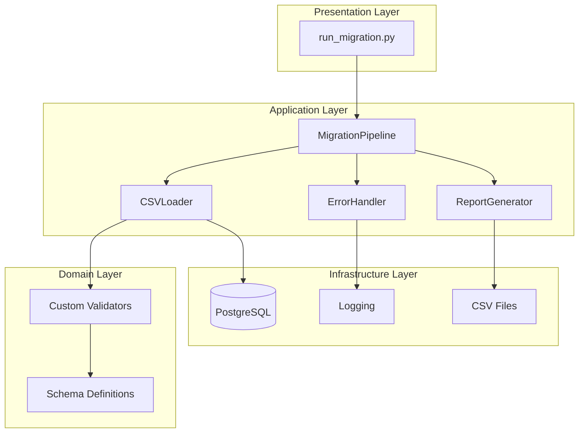
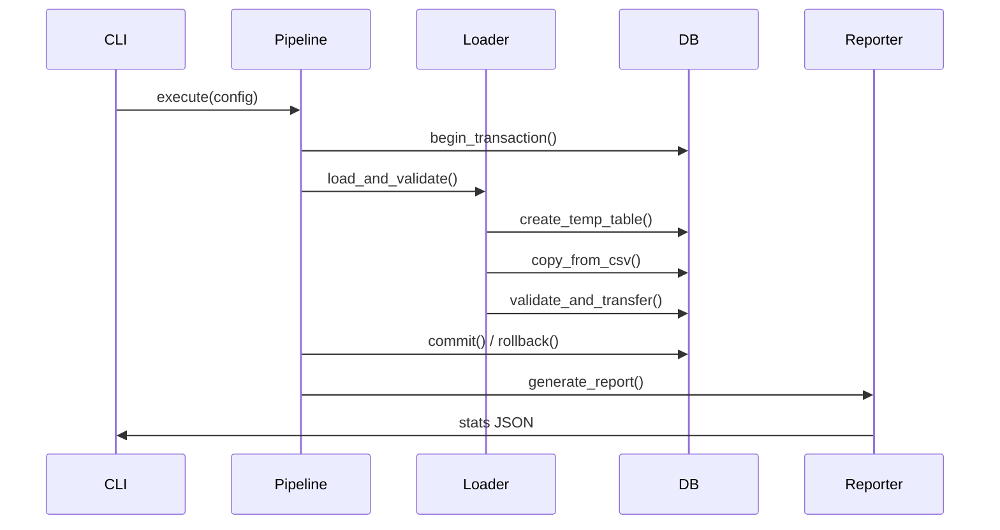

# Migrador CSV → PostgreSQL


> 🚀 **Migrador de datos CSV a PostgreSQL** con validación reutilizable, transacciones atómicas y reporting estructurado.

---

## 📋 Tabla de Contenidos

- [Propósito](#propósito)
- [Instalación](#instalación)
- [Uso Rápido](#uso-rápido)
- [Arquitectura](#arquitectura)
- [Estructura del Proyecto](#estructura-del-proyecto)
- [Comandos CLI](#comandos-cli)
- [Testing](#testing)
- [Documentación](#documentación)
- [Contribución](#contribución)

---

## 🎯 Propósito

Migrador CSV → PostgreSQL es una herramienta de línea de comandos que:

- **Valida** datos CSV contra esquemas YAML configurables
- **Migra** datos a PostgreSQL con transacciones atómicas
- **Reporta** resultados estructurados (JSON, CLI)
- **Reutiliza** validadores mediante patrones Strategy y Repository

### Problemas que Resuelve
- ❌ **Migraciones manuales**: Scripts SQL frágiles y no reutilizables
- ❌ **Validación duplicada**: Cada proyecto reinventa validadores de datos
- ❌ **Errores silenciosos**: Migraciones fallan sin reportes claros
- ❌ **Falta de atomicidad**: Datos parciales en caso de errores

### Beneficios
- ✅ **Validación declarativa**: Esquemas YAML como contrato de datos
- ✅ **Transacciones ACID**: Rollback automático en umbrales de error
- ✅ **Reporting estructurado**: Métricas de importación/rechazo
- ✅ **Extensibilidad**: Patrones SOLID para agregar validadores

---

## 🚀 Instalación

### Requisitos Previos
- Python 3.11+
- PostgreSQL 15+
- Git (para submodules)

### Paso 1: Clonar con Submodules
```bash
git clone --recurse-submodules https://github.com/Fisherk2/migrator-csv-postgres
cd migrator-csv-postgres

# Si olvidaste --recurse-submodules:
git submodule update --init --recursive
```

### Paso 2: Entorno Virtual
```bash
python -m venv venv
source venv/bin/activate  # Linux/Mac
# venv\Scripts\activate  # Windows
```

### Paso 3: Dependencias
```bash
pip install -r requirements.txt
```

### Paso 4: Configurar Base de Datos
```bash
# Copiar configuración
cp .env.example .env

# Editar credenciales
nano .env
```

### Paso 5: Inicializar Base de Datos
```bash
# Usar script automatizado (recomendado)
./scripts/run_schema.sh

# O ejecutar scripts SQL manualmente
psql -U postgres -d postgres -f scripts/sql/01_create_database.sql
psql -U postgres -d migrator_ecommerce -f scripts/sql/02_create_schema.sql
```

---

## ⚡ Uso Rápido

### Migración Básica
```bash
python scripts/run_migration.py --config config/default_migration.yaml
```

### Validación Sin Modificar (Dry Run)
```bash
python scripts/run_migration.py --config config/default_migration.yaml --dry-run
```

### Logs Detallados
```bash
python scripts/run_migration.py --config config/default_migration.yaml --verbose
```

### Archivo de Configuración Personalizado
```bash
python scripts/run_migration.py --config config/schema_examples/customers_schema.yaml --env-file .env.local
```

---

## 🏗️ Arquitectura

### Clean Architecture



### Patrones Aplicados
- **Template Method**: `MigrationPipeline.execute()` orquesta el flujo
- **Strategy**: Validadores configurables por tipo de dato
- **Repository**: `DBConnector` abstrae operaciones PostgreSQL
- **Facade**: CLI simplifica interacción con componentes internos

### Flujo de Ejecución



---

## 📁 Estructura del Proyecto

```
migrator-csv-postgres/
├── 📄 README.md                    # Documentación principal
├── 📄 CONTRIBUTING.MD               # Guía de contribución
├── 📄 AGENT.MD                     # Contexto para agentes IA
├── 📄 requirements.txt             # Dependencias Python
├── 📄 .env.example                 # Template de variables entorno
├── 📄 docker-compose.yml           # PostgreSQL para desarrollo
├── 📁 src/                         # Código fuente
│   ├── 📁 migrator/               # Lógica de negocio
│   │   ├── 📄 pipeline.py         # Orquestador principal
│   │   ├── 📄 csv_loader.py       # Carga y validación CSV
│   │   ├── 📄 db_connector.py     # Conexión PostgreSQL
│   │   ├── 📄 error_handler.py    # Manejo de errores
│   │   └── 📄 report_generator.py # Generación de reportes
│   └── 📁 utils/                  # Utilidades compartidas
│       ├── 📄 logger.py           # Configuración logging
│       └── 📄 helpers.py          # Funciones auxiliares
├── 📁 scripts/                    # Scripts de ejecución
│   ├── 📄 run_migration.py        # CLI principal
│   ├── 📄 init_db.py              # Inicialización BD
│   ├── 📄 run_schema.sh           # Ejecución de scripts SQL (Docker)
│   ├── 📄 run_integration_tests.sh  # Orquestador de pruebas E2E
│   ├── 📄 verify_setup.sh         # Verificación de entorno
│   └── 📁 sql/                    # Scripts SQL
│       ├── 📄 01_create_database.sql
│       ├── 📄 02_create_schema.sql
│       ├── 📄 03_create_indexes.sql
│       ├── 📄 drop_database.sql
│       └── 📄 test_schema_operations.sql
├── 📁 config/                     # Configuración YAML
│   ├── 📄 default_migration.yaml  # Configuración por defecto
│   └── 📁 schema_examples/        # Esquemas de validación
│       ├── 📄 customers_schema.yaml
│       ├── 📄 orders_schema.yaml
│       └── 📄 products_schema.yaml
├── 📁 tests/                      # Tests
│   ├── 📄 conftest.py             # Fixtures pytest
│   ├── 📄 test_integration.py     # Orquestador E2E (Python)
│   ├── 📁 unit/                   # Tests unitarios
│   ├── 📁 integration/            # Tests de integración
│   └── 📁 fixtures/               # Datos de prueba
│       ├── 📄 customers_valid.csv
│       ├── 📄 customers_invalid_email.csv
│       ├── 📄 customers_invalid_phone.csv
│       └── 📄 customers_mixed.csv
├── 📁 docs/                       # Documentación técnica
│   ├── 📄 TESTING_STRATEGY.md     # Estrategia de pruebas en 4 fases
│   ├── 📄 ADR.md                  # Decisiones arquitectónicas
│   ├── 📄 ERD.md                  # Diagrama Entidad-Relación
│   ├── 📄 POSTGRES_SETUP.md       # Guía de configuración
│   ├── 📄 REUSE_STRATEGY.md       # Estrategia de reuso del auditor
│   └── 📄 TROUBLESHOOTING.md       # Guía de diagnóstico
└── 📁 extern/                     # Dependencias externas
    └── 📁 auditor/                # Git submodule: validadores
```

---

## 🔧 Comandos CLI

### Opciones Disponibles
```bash
python scripts/run_migration.py --help
```

| Flag | Descripción | Ejemplo |
|------|-------------|---------|
| `--config` | Ruta a YAML de configuración (requerido) | `--config config/custom.yaml` |
| `--env-file` | Archivo .env con credenciales (opcional) | `--env-file .env.local` |
| `--dry-run` | Validar sin modificar BD | `--dry-run` |
| `--verbose` | Logs detallados (DEBUG) | `--verbose` |

### Ejemplos de Uso

#### Migración Completa
```bash
python scripts/run_migration.py --config config/default_migration.yaml --verbose
```

#### Validación Previa
```bash
python scripts/run_migration.py --config config/schema_examples/customers_schema.yaml --dry-run
```

#### Entorno Específico
```bash
python scripts/run_migration.py --config config/custom.yaml --env-file .env.staging
```

---

## 🧪 Testing

### Estrategia en 4 Fases

El proyecto implementa una estrategia de testing escalonada documentada en `docs/TESTING_STRATEGY.md`:

| Fase | Comando | Propósito | Tiempo Estimado |
|------|---------|-----------|-----------------|
| 1. Verificación de entorno | `./scripts/verify_setup.sh` | Validar integridad de BD y contenedor | <2 min |
| 2. Unitarias con mocks | `python3 -m pytest tests/unit/ -v` | Validar lógica aislada sin dependencias externas | <1 min |
| 3. Integración con pytest | `./scripts/run_schema.sh && pytest tests/integration/ -v -m integration` | Validar interacción de componentes con BD real | 5-10 min |
| 4. E2E autónomo | `./scripts/run_integration_tests.sh --verbose` | Validación completa end-to-end con limpieza automática | 10-15 min |

### Ejecutar Todos los Tests
```bash
# Ejecución completa recomendada
./scripts/verify_setup.sh
python3 -m pytest tests/unit/ -v
./scripts/run_schema.sh && pytest tests/integration/ -v -m integration
./scripts/run_integration_tests.sh --verbose
```

### Tests Unitarios
```bash
python3 -m pytest tests/unit/ -v
```

### Tests de Integración
```bash
./scripts/run_schema.sh && pytest tests/integration/ -v -m integration
```

### Cobertura de Código
```bash
pytest --cov=src --cov-report=html
```

---

## 📚 Documentación

### Documentación Técnica
- **[TESTING_STRATEGY.md](docs/TESTING_STRATEGY.md)** - Estrategia de pruebas en 4 fases
- **[ADR.md](docs/ADR.md)** - Decisiones Arquitectónicas
- **[ERD.md](docs/ERD.md)** - Diagrama Entidad-Relación
- **[POSTGRES_SETUP.md](docs/POSTGRES_SETUP.md)** - Configuración PostgreSQL
- **[REUSE_STRATEGY.md](docs/REUSE_STRATEGY.md)** - Estrategia de reuso del auditor
- **[TROUBLESHOOTING.md](docs/TROUBLESHOOTING.md)** - Guía de diagnóstico

### Configuración
- **[config/default_migration.yaml](config/default_migration.yaml)** - Plantilla de configuración
- **[config/schema_examples/](config/schema_examples/)** - Esquemas de validación por entidad

### Guías de Contribución
- **[CONTRIBUTING.MD](CONTRIBUTING.MD)** - Flujo de trabajo y estándares
- **[AGENT.MD](AGENT.MD)** - Contexto para agentes de IA

---

## 🤝 Contribución

¡Las contribuciones son bienvenidas! Por favor lee [CONTRIBUTING.MD](CONTRIBUTING.MD) para:

- Flujo de trabajo (fork → branch → PR)
- Estándares de código (PEP 8, type hints, docstrings)
- Requisitos de testing (pytest, cobertura mínima)
- Proceso de review y merge

---

## 📄 Licencia

MIT License - ver archivo [LICENSE](LICENSE) para detalles.

---

> 💡 **Nota**: Este proyecto sigue principios de Clean Architecture y SOLID. Cada componente tiene una responsabilidad única y clara separación de preocupaciones.