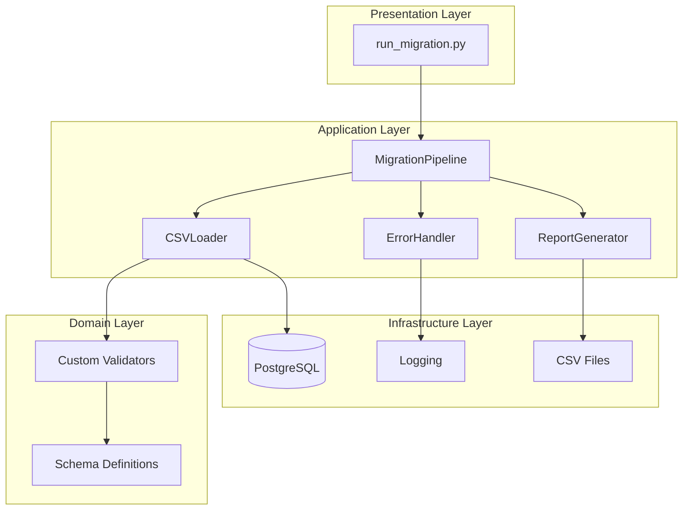
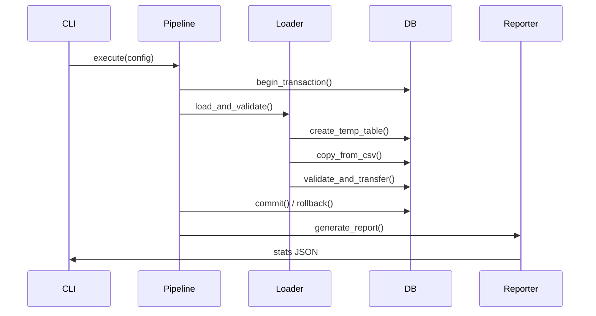

# Migrador CSV → PostgreSQL


> 🚀 **Migrador de datos CSV a PostgreSQL** con validación reutilizable, transacciones atómicas y reporting estructurado.

---

## 📋 Tabla de Contenidos

- [Propósito](#propósito)
- [Instalación](#instalación)
- [Uso Rápido](#uso-rápido)
- [Arquitectura](#arquitectura)
- [Estructura del Proyecto](#estructura-del-proyecto)
- [Comandos CLI](#comandos-cli)
- [Testing](#testing)
- [Documentación](#documentación)
- [Contribución](#contribución)

---

## 🎯 Propósito

Migrador CSV → PostgreSQL es una herramienta de línea de comandos que:

- **Valida** datos CSV contra esquemas YAML configurables
- **Migra** datos a PostgreSQL con transacciones atómicas
- **Reporta** resultados estructurados (JSON, CLI)
- **Reutiliza** validadores mediante patrones Strategy y Repository

### Problemas que Resuelve
- ❌ **Migraciones manuales**: Scripts SQL frágiles y no reutilizables
- ❌ **Validación duplicada**: Cada proyecto reinventa validadores de datos
- ❌ **Errores silenciosos**: Migraciones fallan sin reportes claros
- ❌ **Falta de atomicidad**: Datos parciales en caso de errores

### Beneficios
- ✅ **Validación declarativa**: Esquemas YAML como contrato de datos
- ✅ **Transacciones ACID**: Rollback automático en umbrales de error
- ✅ **Reporting estructurado**: Métricas de importación/rechazo
- ✅ **Extensibilidad**: Patrones SOLID para agregar validadores

---

## 🚀 Instalación

### Requisitos Previos
- Python 3.11+
- PostgreSQL 15+
- Git (para submodules)

### Paso 1: Clonar con Submodules
```bash
git clone --recurse-submodules https://github.com/Fisherk2/migrator-csv-postgres
cd migrator-csv-postgres

# Si olvidaste --recurse-submodules:
git submodule update --init --recursive
```

### Paso 2: Entorno Virtual
```bash
python -m venv venv
source venv/bin/activate  # Linux/Mac
# venv\Scripts\activate  # Windows
```

### Paso 3: Dependencias
```bash
pip install -r requirements.txt
```

### Paso 4: Configurar Base de Datos
```bash
# Copiar configuración
cp .env.example .env

# Editar credenciales
nano .env
```

### Paso 5: Inicializar Base de Datos
```bash
# Crear esquema
psql -U postgres -d postgres -f scripts/sql/01_create_database.sql
psql -U postgres -d migrator_ecommerce -f scripts/sql/02_create_schema.sql
```

---

## ⚡ Uso Rápido

### Migración Básica
```bash
python scripts/run_migration.py --config config/default_migration.yaml
```

### Validación Sin Modificar (Dry Run)
```bash
python scripts/run_migration.py --config config/default_migration.yaml --dry-run
```

### Logs Detallados
```bash
python scripts/run_migration.py --config config/default_migration.yaml --verbose
```

### Archivo de Configuración Personalizado
```bash
python scripts/run_migration.py --config config/schema_examples/customers_schema.yaml --env-file .env.local
```

---

## 🏗️ Arquitectura

### Clean Architecture



### Patrones Aplicados
- **Template Method**: `MigrationPipeline.execute()` orquesta el flujo
- **Strategy**: Validadores configurables por tipo de dato
- **Repository**: `DBConnector` abstrae operaciones PostgreSQL
- **Facade**: CLI simplifica interacción con componentes internos

### Flujo de Ejecución



---

## 📁 Estructura del Proyecto

```
migrator-csv-postgres/
├── 📄 README.md                    # Documentación principal
├── 📄 CONTRIBUTING.MD               # Guía de contribución
├── 📄 AGENT.MD                     # Contexto para agentes IA
├── 📄 requirements.txt             # Dependencias Python
├── 📄 .env.example                 # Template de variables entorno
├── 📄 docker-compose.yml           # PostgreSQL para desarrollo
├── 📁 src/                         # Código fuente
│   ├── 📁 migrator/               # Lógica de negocio
│   │   ├── 📄 pipeline.py         # Orquestador principal
│   │   ├── 📄 csv_loader.py       # Carga y validación CSV
│   │   ├── 📄 db_connector.py     # Conexión PostgreSQL
│   │   ├── 📄 error_handler.py    # Manejo de errores
│   │   └── 📄 report_generator.py # Generación de reportes
│   └── 📁 utils/                  # Utilidades compartidas
│       ├── 📄 logger.py           # Configuración logging
│       └── 📄 helpers.py          # Funciones auxiliares
├── 📁 scripts/                    # Scripts de ejecución
│   ├── 📄 run_migration.py        # CLI principal
│   ├── 📄 init_db.py              # Inicialización BD
│   └── 📁 sql/                    # Scripts SQL
│       ├── 📄 01_create_database.sql
│       ├── 📄 02_create_schema.sql
│       └── 📄 03_create_indexes.sql
├── 📁 config/                     # Configuración YAML
│   ├── 📄 default_migration.yaml  # Configuración por defecto
│   └── 📁 schema_examples/        # Esquemas de validación
│       ├── 📄 customers_schema.yaml
│       ├── 📄 orders_schema.yaml
│       └── 📄 products_schema.yaml
├── 📁 test/                       # Tests
│   ├── 📄 conftest.py             # Fixtures pytest
│   ├── 📁 unit/                   # Tests unitarios
│   ├── 📁 integration/            # Tests de integración
│   └── 📁 fixtures/               # Datos de prueba
│       ├── 📄 valid_customers.csv
│       └── 📄 invalid_customers.csv
├── 📁 docs/                       # Documentación técnica
│   ├── 📄 ADR.md                  # Decisiones arquitectónicas
│   ├── 📄 ERD.md                  # Diagrama Entidad-Relación
│   └── 📄 POSTGRES_SETUP.md       # Guía de configuración
└── 📁 extern/                     # Dependencias externas
    └── 📁 auditor/                # Git submodule: validadores
```

---

## 🔧 Comandos CLI

### Opciones Disponibles
```bash
python scripts/run_migration.py --help
```

| Flag | Descripción | Ejemplo |
|------|-------------|---------|
| `--config` | Ruta a YAML de configuración (requerido) | `--config config/custom.yaml` |
| `--env-file` | Archivo .env con credenciales (opcional) | `--env-file .env.local` |
| `--dry-run` | Validar sin modificar BD | `--dry-run` |
| `--verbose` | Logs detallados (DEBUG) | `--verbose` |

### Ejemplos de Uso

#### Migración Completa
```bash
python scripts/run_migration.py --config config/default_migration.yaml --verbose
```

#### Validación Previa
```bash
python scripts/run_migration.py --config config/schema_examples/customers_schema.yaml --dry-run
```

#### Entorno Específico
```bash
python scripts/run_migration.py --config config/custom.yaml --env-file .env.staging
```

---

## 🧪 Testing

### Ejecutar Todos los Tests
```bash
pytest
```

### Tests Unitarios
```bash
pytest test/unit/
```

### Tests de Integración
```bash
pytest test/integration/ -m integration
```

### Cobertura de Código
```bash
pytest --cov=src --cov-report=html
```

### Variables de Entorno para Tests
```bash
export TEST_DB_AVAILABLE=true
export TEST_DB_HOST=localhost
export TEST_DB_NAME=migrator_test
export TEST_DB_USER=test_user
export TEST_DB_PASSWORD=test_password
```

---

## 📚 Documentación

### Documentación Técnica
- **[ADR.md](docs/ADR.md)** - Decisiones Arquitectónicas
- **[ERD.md](docs/ERD.md)** - Diagrama Entidad-Relación
- **[POSTGRES_SETUP.md](docs/POSTGRES_SETUP.md)** - Configuración PostgreSQL

### Configuración
- **[config/default_migration.yaml](config/default_migration.yaml)** - Plantilla de configuración
- **[config/schema_examples/](config/schema_examples/)** - Esquemas de validación por entidad

### Guías de Contribución
- **[CONTRIBUTING.MD](CONTRIBUTING.MD)** - Flujo de trabajo y estándares
- **[AGENT.MD](AGENT.MD)** - Contexto para agentes de IA

---

## 🤝 Contribución

¡Las contribuciones son bienvenidas! Por favor lee [CONTRIBUTING.MD](CONTRIBUTING.MD) para:

- Flujo de trabajo (fork → branch → PR)
- Estándares de código (PEP 8, type hints, docstrings)
- Requisitos de testing (pytest, cobertura mínima)
- Proceso de review y merge

---

## 📄 Licencia

MIT License - ver archivo [LICENSE](LICENSE) para detalles.

---

> 💡 **Nota**: Este proyecto sigue principios de Clean Architecture y SOLID. Cada componente tiene una responsabilidad única y clara separación de preocupaciones.

---

## 📋 Tabla de Contenidos

- [Descripción del Proyecto](#descripción-del-proyecto)
- [Requisitos Previos](#requisitos-previos)
- [Inicio Rápido (Quick Start)](#inicio-rápido-quick-start)
- [Estructura del Proyecto](#estructura-del-proyecto)
- [Comandos Disponibles](#comandos-disponibles)
- [Documentación Relacionada](#documentación-relacionada)
- [Solución de Problemas](#solución-de-problemas)
- [Contribución](#contribución)
- [Licencia](#licencia)

---

## 📖 Descripción del Proyecto

Este template proporciona una estructura completa y replicable para proyectos de base de datos PostgreSQL, incluyendo:

### 🎯 Propósito Principal
- **Estandarización:** Base consistente para todos los proyectos de datos del equipo
- **Productividad:** Setup automático y validación de infraestructura
- **Documentación:** Completa con ERD, ADRs y convenciones
- **Onboarding:** Nuevo desarrollador productivo en <10 minutos

### 💡 Problemas que Resuelve
- ❌ **Inconsistencia:** Cada proyecto usa diferente estructura y nomenclatura
- ❌ **Configuración manual:** Setup repetitivo y propenso a errores
- ❌ **Documentación dispersa:** Falta de documentación centralizada
- ❌ **Validación manual:** Sin automatización para verificar configuración

### ✅ Beneficios para el Equipo
- 🚀 **Rapidez:** Setup completo en minutos, no horas
- 📚 **Conocimiento:** Documentación completa y accesible
- 🔧 **Consistencia:** Mismas convenciones en todos los proyectos
- 🛡️ **Calidad:** Validación automática de configuración

---

## ⚡ Requisitos Previos

### Software Obligatorio
- **PostgreSQL 15+** - Motor de base de datos principal
- **psql** - Cliente CLI para PostgreSQL (incluido con PostgreSQL)
- **Bash 4+** - Para ejecutar scripts de automatización
- **Git** - Control de versiones

### Software Recomendado
- **pgAdmin** - Interfaz gráfica para PostgreSQL
- **DBeaver** - Cliente SQL multiplataforma
- **Docker** - Para entornos de desarrollo aislados
- **VS Code** - Editor de código con extensiones SQL

### Verificación de Requisitos
```bash
# Verificar PostgreSQL
psql --version

# Verificar Bash
bash --version

# Verificar Git
git --version
```

---

## 🚀 Inicio Rápido (Quick Start)

> ⏱️ **Tiempo estimado:** 5-10 minutos para desarrolladores familiarizados con PostgreSQL

### Paso 1: Clonar el Proyecto
```bash
git clone https://github.com/Fisherk2/plantilla-proyecto-sistema-datos
cd plantilla-proyecto-sistema-datos
```

### Paso 2: Configurar Variables de Entorno
```bash
# Copiar archivo de ejemplo
cp connection_example.env .env

# Editar con tus credenciales
nano .env
```

### Paso 3: Crear Base de Datos
```bash
# Crear base de datos (idempotente)
psql -U postgres -d postgres -f create_database.sql
```

### Paso 4: Ejecutar Migraciones
```bash
# Crear tablas en orden correcto
psql -U postgres -d your_database_name -f migrations/001_create_users_table.sql
psql -U postgres -d your_database_name -f migrations/002_create_projects_table.sql
```

### Paso 5: Poblar Datos de Prueba
```bash
# Insertar datos seed
psql -U postgres -d your_database_name -f seeds/001_seed_users.sql
psql -U postgres -d your_database_name -f seeds/002_seed_projects.sql
```

### Paso 6: Validar Configuración
```bash
# Dar permisos de ejecución
chmod +x verify_setup.sh

# Ejecutar validación completa
./verify_setup.sh
```

### ✅ Verificación Final
Si todo está correcto, deberías ver:
```
🎉 ¡Todas las validaciones pasaron exitosamente!
✅ La base de datos está lista para uso
```

---

## 📁 Estructura del Proyecto

```
03-plantilla-proyecto-sistema-datos/
├── 📄 README.md                    # Documentación principal (este archivo)
├── 📄 .gitignore                   # Archivos ignorados por Git
├── 📄 connection_example.env         # Template de configuración
├── 📄 .env                        # Variables de entorno (crear desde ejemplo)
├── 📄 create_database.sql           # Script de creación de BD (idempotente)
├── 📄 drop_database.sql             # Script de eliminación segura de BD
├── 📄 verify_setup.sh               # Validación completa del setup
├── 📄 ADR.md                      # Decisiones arquitectónicas
├── 📄 naming_conventions.md         # Convenciones de nomenclatura
├── 📁 migrations/                   # Scripts de migración de estructura
│   ├── 📄 001_create_users_table.sql
│   └── 📄 002_create_projects_table.sql
├── 📁 seeds/                       # Datos de prueba
│   ├── 📄 001_seed_users.sql
│   └── 📄 002_seed_projects.sql
└── 📁 docs/                        # Documentación técnica
    └── 📄 ERD.md                    # Diagrama Entidad-Relación
```

### Descripción de Directorios
- **`migrations/`** - Scripts DDL para crear/modificar estructura de tablas
- **`seeds/`** - Datos de prueba para desarrollo y testing
- **`docs/`** - Documentación técnica (ERD, diagramas, etc.)
- **Raíz** - Scripts de configuración y automatización

---

## 🔧 Comandos Disponibles

### Scripts de Base de Datos
```bash
# Crear base de datos (idempotente)
psql -U postgres -d postgres -f create_database.sql

# Eliminar base de datos (con salvaguardas)
psql -U postgres -d postgres -f drop_database.sql

# Validar setup completo
./verify_setup.sh
```

### Migraciones (ejecutar en orden)
```bash
# Crear tabla de usuarios
psql -U postgres -d your_database_name -f migrations/001_create_users_table.sql

# Crear tabla de proyectos
psql -U postgres -d your_database_name -f migrations/002_create_projects_table.sql
```

### Datos de Prueba
```bash
# Poblar usuarios de prueba
psql -U postgres -d your_database_name -f seeds/001_seed_users.sql

# Poblar proyectos de prueba
psql -U postgres -d your_database_name -f seeds/002_seed_projects.sql
```

### Utilidades Adicionales
```bash
# Verificar estado de PostgreSQL
systemctl status postgresql

# Conectar a base de datos
psql -U postgres -d your_database_name

# Listar bases de datos
psql -U postgres -l
```

---

## 📚 Documentación Relacionada

### 📋 Decisiones Arquitectónicas
- **[ADR.md](ADR.md)** - Registro completo de decisiones arquitectónicas
  - Selección de PostgreSQL vs alternativas
  - Convenciones de nomenclatura
  - Estrategia de soft delete

### 🗺️ Modelo de Datos
- **[docs/ERD.md](docs/ERD.md)** - Diagrama Entidad-Relación completo
  - Visualización de tablas y relaciones
  - Diccionario de datos completo
  - Decisiones de diseño justificadas

### 📝 Convenciones
- **[naming_conventions.md](naming_conventions.md)** - Estándares de nomenclatura
  - Reglas para tablas, columnas, índices
  - Ejemplos de buenas y malas prácticas
  - Checklist de validación

---

## 🔧 Solución de Problemas

### ❓ FAQ - Preguntas Frecuentes

#### 1. Error: "FATAL: database does not exist"
**Causa:** La base de datos no ha sido creada  
**Solución:** Ejecuta primero `create_database.sql`
```bash
psql -U postgres -d postgres -f create_database.sql
```

#### 2. Error: "permission denied for relation users"
**Causa:** El usuario no tiene permisos en la base de datos  
**Solución:** Conéctate como superusuario o da permisos adecuados
```bash
# Como superusuario
psql -U postgres -d your_database_name

# O da permisos
GRANT ALL PRIVILEGES ON DATABASE your_database_name TO your_user;
```

#### 3. Error: "relation already exists"
**Causa:** Migración ejecutada múltiples veces sin idempotencia  
**Solución:** Los scripts son idempotentes, pero si fallan, limpia manualmente
```bash
# Eliminar tablas (cuidado con producción)
DROP TABLE IF EXISTS projects, users CASCADE;
```

#### 4. Error: "connection refused"
**Causa:** PostgreSQL no está corriendo o puerto incorrecto  
**Solución:** Verifica estado y configuración
```bash
# Verificar si PostgreSQL está corriendo
systemctl status postgresql

# Iniciar PostgreSQL
sudo systemctl start postgresql

# Verificar puerto
netstat -an | grep 5432
```

#### 5. Error: "FATAL: role "postgres" does not exist"
**Causa:** Configuración de usuario incorrecta en `.env`  
**Solución:** Crea el usuario o usa el usuario correcto
```bash
# Crear usuario postgres (si no existe)
sudo -u postgres createuser -s postgres

# O usa tu usuario actual
whoami  # y pon ese valor en DB_USER
```

### 🆘 Obtener Ayuda Adicional
- **Logs de PostgreSQL:** `/var/log/postgresql/`
- **Documentación oficial:** https://www.postgresql.org/docs/
- **Issues del proyecto:** Crear issue en el repositorio

---

## 🤝 Contribución

¡Las contribuciones son bienvenidas! Por favor lee nuestra [guía de contribución](CONTRIBUTING.MD) para detalles sobre:

- Cómo reportar problemas y sugerir mejoras
- Flujo de trabajo para Pull Requests
- Estándares de código y convenciones
- Template para reporte de issues

### 📋 Checklist Rápido
- [ ] Lee la [guía completa](CONTRIBUTING.MD)
- [ ] Sigue las convenciones de [nomenclatura](naming_conventions.md)
- [ ] Ejecuta `./verify_setup.sh` antes de submit
- [ ] Actualiza documentación si aplica

---

## 📄 Licencia

Este proyecto está licenciado bajo **MIT License** - puedes ver el archivo [LICENSE](LICENSE) para detalles completos.

### 📋 Resumen de Licencia
- ✅ **Uso comercial:** Permitido
- ✅ **Modificación:** Permitida
- ✅ **Distribución:** Permitida
- ✅ **Uso privado:** Permitido
- ❌ **Responsabilidad:** Sin garantía
- ℹ️ **Atribución:** Requerida (mantener copyright)

---

## 🌟 Agradecimientos

Este template fue creado siguiendo principios de:
- **Clean Architecture** - Robert C. Martin
- **Clean Code** - Robert C. Martin  
- **Systems Analysis and Design** - Kendall & Kendall

---

> 💡 **Nota para Mantenedores:** Este README debe mantenerse sincronizado con los cambios en el proyecto. Cada nuevo script o modificación estructural debe reflejarse aquí para asegurar que el onboarding siga siendo efectivo.

---

**🚀 ¿Listo para comenzar?** Sigue el [Inicio Rápido](#inicio-rápido-quick-start) y tendrás tu base de datos funcionando en minutos!