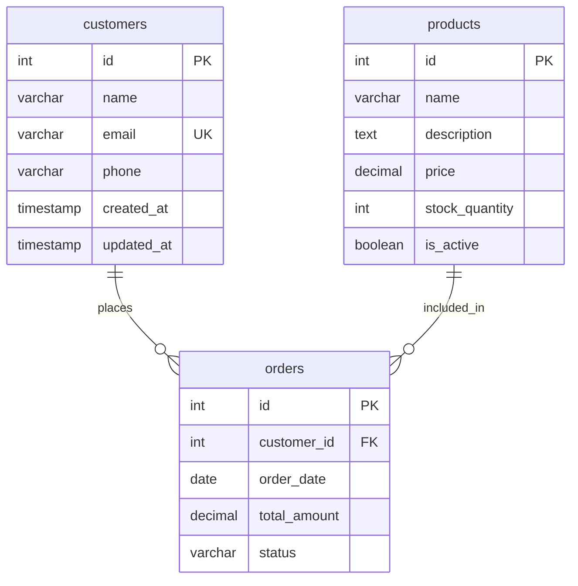

# Entity Relationship Diagram (ERD) - Migrador CSV E-commerce

---
metadata:
  tipo_documento: Diagrama Entidad-Relación
  dominio: Modelado de Datos
  estado: Aprobado
  fecha_creacion: 2026-04-27
  fecha_actualizacion: 2026-04-27
  autor: fisherk2, DBA Senior
  revisores: [Equipo de Desarrollo]
  stakeholders: [Desarrolladores, DBAs, Equipo QA]
  tags: [erd, modelo-de-datos, postgresql, e-commerce]
  version: 1.0
  relacionado_con: [[scripts/sql/02_create_schema.sql]], [[config/schema_examples]]
---

## Introducción

Este documento define el modelo de datos del dominio e-commerce para el Migrador CSV. Según *Clean Architecture* (Cap. 30), la base de datos es un detalle de implementación, pero su contrato (ERD) es parte del dominio y debe documentarse explícitamente.

**Propósito:**
- Definir contrato de datos entre dominio e infraestructura
- Documentar cardinalidades y constraints
- Alinear esquema YAML (dominio) con SQL (infraestructura)
- Facilitar validación de datos y migración

**Dominio de Negocio:**
- **Customers:** Entidad principal de clientes del e-commerce
- **Products:** Catálogo de productos independientes
- **Orders:** Órdenes de compra vinculadas a customers

---

## 📊 Diagrama ERD



**Notación Mermaid:**
- `||--o{`: Uno a Muchos, Opcional (0 o N)
- `PK`: Primary Key
- `FK`: Foreign Key
- `UK`: Unique Key

---

## 📋 Descripción de Entidades

### customers
**Propósito de Negocio:** Entidad principal de clientes del e-commerce. Almacena información de contacto y autenticación necesaria para procesar órdenes.

**Características Clave:**
- Email único como identificador de login
- Teléfono opcional para contacto y soporte
- Timestamps automáticos para auditoría
- Trigger para actualización automática de `updated_at`

**Alineación YAML vs SQL:**
- YAML: `config/schema_examples/customers_schema.yaml`
- SQL: `scripts/sql/02_create_schema.sql` (líneas 12-40)

### products
**Propósito de Negocio:** Catálogo de productos del e-commerce. Entidad independiente en MVP, no tiene dependencias directas con customers u orders.

**Características Clave:**
- Precio con validación de no negativos (`CHECK (price >= 0)`)
- Stock con validación de no negativos (`CHECK (stock_quantity >= 0)`)
- Estado activo/inactivo para visibilidad en catálogo
- Índice parcial para productos activos (`WHERE is_active = true`)

**Alineación YAML vs SQL:**
- YAML: `config/schema_examples/products_schema.yaml`
- SQL: `scripts/sql/02_create_schema.sql` (líneas 44-72)

### orders
**Propósito de Negocio:** Órdenes de compra del e-commerce. Vincula customers con productos (en MVP, solo almacena relación con customer).

**Características Clave:**
- FK a customers con `ON DELETE RESTRICT` (protege historial)
- Status con constraint de valores válidos
- Total con validación de no negativos
- Índices para queries por customer y status

**Alineación YAML vs SQL:**
- YAML: `config/schema_examples/orders_schema.yaml`
- SQL: `scripts/sql/02_create_schema.sql` (líneas 76-113)

---

## 🔗 Descripción de Relaciones

### customers → orders (1:N)
**Cardinalidad:** `||--o{` (Uno a Muchos, Opcional)

**Regla de Negocio:**
- Un customer puede tener cero o muchas orders
- Cada order debe tener exactamente un customer
- **Integridad Referencial:** `ON DELETE RESTRICT` - No se puede eliminar un customer con orders

**Constraint SQL:**
```sql
CONSTRAINT fk_orders_customer 
    FOREIGN KEY (customer_id) 
    REFERENCES public.customers(id) 
    ON DELETE RESTRICT
```

**Justificación:** Protege el historial de órdenes contra eliminación accidental de customers. Para eliminar un customer, primero deben eliminarse o reasignarse sus orders.

### products → orders (1:N)
**Cardinalidad:** `||--o{` (Uno a Muchos, Opcional)

**Regla de Negocio:**
- Un product puede estar incluido en cero o muchas orders
- En MVP, orders no almacena relación directa con products (futuro: tabla order_items)

**Nota de MVP:** En MVP actual, orders no tiene FK directa a products. Esta relación se implementará en Fase 2 con tabla `order_items`.

---

## 📖 Diccionario de Datos

### Tabla: customers

| Columna | Tipo SQL | Tipo Dominio (YAML) | Restricciones | Descripción |
|---------|---------|-------------------|---------------|-------------|
| id | SERIAL | integer | PRIMARY KEY | Identificador único autoincremental |
| name | VARCHAR(100) | string | NOT NULL | Nombre completo requerido para facturación |
| email | VARCHAR(255) | email | NOT NULL, UNIQUE | Email único, usado como login principal |
| phone | VARCHAR(20) | string | NULL | Teléfono opcional para contacto y soporte |
| created_at | TIMESTAMP | datetime | DEFAULT CURRENT_TIMESTAMP | Fecha de registro automática |
| updated_at | TIMESTAMP | datetime | DEFAULT CURRENT_TIMESTAMP | Última modificación (trigger automático) |

**Trigger Automático:**
```sql
CREATE TRIGGER update_customers_updated_at 
    BEFORE UPDATE ON public.customers 
    FOR EACH ROW 
    EXECUTE FUNCTION update_updated_at_column();
```

### Tabla: products

| Columna | Tipo SQL | Tipo Dominio (YAML) | Restricciones | Descripción |
|---------|---------|-------------------|---------------|-------------|
| id | SERIAL | integer | PRIMARY KEY | Identificador único del producto |
| name | VARCHAR(200) | string | NOT NULL | Nombre visible en catálogo y búsquedas |
| description | TEXT | string | NULL | Detalles para página de producto |
| price | DECIMAL(10,2) | float | NOT NULL, CHECK (price >= 0) | Precio unitario en moneda local |
| stock_quantity | INTEGER | integer | NOT NULL, DEFAULT 0, CHECK (stock_quantity >= 0) | Unidades disponibles para venta |
| is_active | BOOLEAN | boolean | DEFAULT true | Producto visible/oculto en catálogo |

**Índice Parcial:**
```sql
CREATE INDEX idx_products_active ON public.products(is_active) WHERE is_active = true;
```

### Tabla: orders

| Columna | Tipo SQL | Tipo Dominio (YAML) | Restricciones | Descripción |
|---------|---------|-------------------|---------------|-------------|
| id | SERIAL | integer | PRIMARY KEY | Identificador único de la orden |
| customer_id | INTEGER | integer | NOT NULL, FK | Cliente que realizó la compra |
| order_date | DATE | date | DEFAULT CURRENT_DATE | Fecha en que se realizó la orden |
| total_amount | DECIMAL(10,2) | float | NOT NULL, CHECK (total_amount >= 0) | Monto total de la orden |
| status | VARCHAR(20) | string | NOT NULL, DEFAULT 'pending', CHECK | Estado actual del proceso |

**Constraint de Status:**
```sql
CHECK (status IN ('pending', 'processing', 'shipped', 'delivered', 'cancelled'))
```

**Índices:**
```sql
CREATE INDEX idx_orders_customer ON public.orders(customer_id);
CREATE INDEX idx_orders_status ON public.orders(status);
```

---

## 🎯 Decisiones de Diseño

### SERIAL vs UUID
**Decisión:** Utilizar `SERIAL` (auto-incremento) para primary keys.

**Justificación:**
- Mejor performance para joins y búsquedas
- Más legible para debugging y queries manuales
- Suficiente para MVP sin requisitos de escalabilidad distribuida

### CHECK Constraints para Valores Negativos
**Decisión:** Validar `price >= 0` y `stock_quantity >= 0` a nivel de BD.

**Justificación:**
- Fail-fast en BD previene datos corruptos
- Última línea de defensa además de validación en aplicación
- PostgreSQL optimiza CHECK constraints eficientemente

### ON DELETE RESTRICT en FK
**Decisión:** Usar `ON DELETE RESTRICT` en `orders.customer_id`.

**Justificación:**
- Protege historial de órdenes contra eliminación de customers
- Fuerza a la aplicación a manejar cleanup explícito
- Previene datos huérfanos sin propietario

### Índices Parciales
**Decisión:** Índice parcial `idx_products_active` con `WHERE is_active = true`.

**Justificación:**
- Optimiza queries de catálogo (solo productos activos)
- Reduce tamaño de índice (excluye productos inactivos)
- Mejora performance de búsquedas en frontend

### Trigger para updated_at
**Decisión:** Trigger automático para actualizar `updated_at` en customers.

**Justificación:**
- Elimina necesidad de actualizar manualmente en aplicación
- Garantiza consistencia de timestamps
- Centraliza lógica de auditoría

---

## 🔍 Alineación Dominio vs Infraestructura

### Separación de Responsabilidades

Según *Clean Architecture* (Cap. 10), la configuración debe estar separada de la lógica:

| Aspecto | Dominio (YAML) | Infraestructura (SQL) |
|---------|----------------|----------------------|
| **Propósito** | Definir contrato de datos | Implementar almacenamiento físico |
| **Validación** | Reglas de negocio (email RFC 5322) | Constraints de BD (UNIQUE, CHECK) |
| **Tipos** | string, integer, email (conceptuales) | VARCHAR, INTEGER, DECIMAL (físicos) |
| **Ubicación** | `config/schema_examples/` | `scripts/sql/02_create_schema.sql` |

### Mapping de Tipos

| Tipo Dominio (YAML) | Tipo SQL (PostgreSQL) | Justificación |
|---------------------|---------------------|---------------|
| string | VARCHAR(n) o TEXT | Longitud variable, UTF-8 |
| integer | INTEGER o SERIAL | Auto-incremento para PK |
| float | DECIMAL(10,2) | Precisión monetaria |
| boolean | BOOLEAN | true/false nativo |
| datetime | TIMESTAMP | Sin zona horaria (local) |
| email | VARCHAR(255) + UNIQUE | Validación regex en aplicación |

---

## 🚀 Cómo Visualizar este Diagrama

### Opción 1: GitHub/GitLab
Este archivo renderizará automáticamente el diagrama Mermaid en GitHub/GitLab.

### Opción 2: Mermaid Live Editor
1. Visita: https://mermaid.live
2. Copia el bloque `mermaid` de este documento
3. Pega en el editor para visualización interactiva

### Opción 3: VS Code con Extensión
1. Instala la extensión "Mermaid Preview"
2. Abre este archivo y usa el preview

---

## 📚 Referencias

- [scripts/sql/02_create_schema.sql](../scripts/sql/02_create_schema.sql) - Implementación SQL
- [config/schema_examples/](../config/schema_examples/) - Definiciones YAML
- [ADR-MIG-004: Separación YAML vs SQL](ADR.md#adr-mig-004-separación-yaml-dominio-vs-sql-infraestructura)
- [POSTGRES_SETUP.md](POSTGRES_SETUP.md) - Configuración de BD

---

> **Nota Importante:** Este ERD representa el MVP actual. En Fase 2, se agregará tabla `order_items` para modelar la relación many-to-many entre orders y products, permitiendo múltiples productos por orden.
