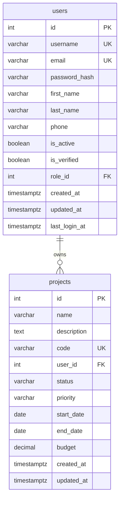

# Entity Relationship Diagram (ERD)

## Información del Documento
- **Propósito:** Documentar el modelo de datos del sistema de gestión de usuarios y proyectos
- **Versión:** 1.0
- **Fecha:** 2026-03-13
- **Autor:** fisherk2
- **Estado:** Activo
- **Dominio:** Sistema de gestión de proyectos con usuarios

---

## Descripción del Dominio

Este modelo de datos representa un sistema de gestión de proyectos donde los usuarios pueden crear y administrar múltiples proyectos. El sistema soporta diferentes roles de usuarios, estados de proyectos, y mantiene un registro completo de auditoría para todas las operaciones.

**Contexto de Negocio:**
- **Usuarios:** Personas que interactúan con el sistema (administradores, desarrolladores, clientes)
- **Proyectos:** Iniciativas de trabajo asignadas a usuarios específicos con seguimiento de estado y presupuesto
- **Relación:** Cada usuario puede ser propietario de múltiples proyectos, pero cada proyecto pertenece a un solo usuario

---

## Diagrama ERD

---

## Descripción de Entidades

### 📋 users
**Propósito de Negocio:** Representa a todas las personas que interactúan con el sistema, incluyendo administradores, desarrolladores, y clientes. Esta entidad centraliza la gestión de identidades y autenticación.

**Características Clave:**
- Autenticación segura con hashes de contraseña
- Verificación de email para seguridad
- Soft delete mediante campo `is_active`
- Auditoría completa con timestamps

---

### 📁 projects
**Propósito de Negocio:** Representa las iniciativas de trabajo asignadas a usuarios específicos. Cada proyecto tiene un ciclo de vida completo desde creación hasta finalización, con seguimiento de presupuesto y estado.

**Características Clave:**
- Código único para referencia interna
- Gestión de estados (active, completed, cancelled, on_hold)
- Control de presupuesto con precisión decimal
- Fechas de planificación para gestión de timelines

---

## Descripción de Relaciones

### 🔗 users → projects (1:N)
**Cardinalidad:** `||--o{` (Uno a Muchos, Opcional)

**Regla de Negocio:** 
- Un usuario puede tener cero o muchos proyectos
- Cada proyecto debe tener exactamente un usuario propietario
- **Integridad Referencial:** Si un usuario es eliminado, todos sus proyectos asociados también se eliminan (ON DELETE CASCADE)

**Justificación:** Esta relación permite que los usuarios administren su propio portafolio de proyectos mientras mantiene la propiedad clara y la responsabilidad sobre cada iniciativa.

---

## Diccionario de Datos

### Tabla: users
| Columna | Tipo | Restricciones | Descripción |
|---------|------|---------------|-------------|
| id | INTEGER | PRIMARY KEY, AUTO_INCREMENT | Identificador único del usuario |
| username | VARCHAR(50) | UNIQUE, NOT NULL | Nombre de usuario para login |
| email | VARCHAR(255) | UNIQUE, NOT NULL | Email para autenticación y notificaciones |
| password_hash | VARCHAR(255) | NOT NULL | Hash de contraseña (bcrypt/argon2) |
| first_name | VARCHAR(100) | NULL | Nombre del usuario |
| last_name | VARCHAR(100) | NULL | Apellido del usuario |
| phone | VARCHAR(20) | NULL | Teléfono de contacto |
| is_active | BOOLEAN | DEFAULT true | Estado de cuenta (soft delete) |
| is_verified | BOOLEAN | DEFAULT false | Estado de verificación de email |
| role_id | INTEGER | NULL | Referencia a tabla de roles (futura) |
| created_at | TIMESTAMPTZ | DEFAULT NOW() | Timestamp de creación |
| updated_at | TIMESTAMPTZ | DEFAULT NOW() | Timestamp de última modificación |
| last_login_at | TIMESTAMPTZ | NULL | Timestamp del último login |

### Tabla: projects
| Columna | Tipo | Restricciones | Descripción |
|---------|------|---------------|-------------|
| id | INTEGER | PRIMARY KEY, AUTO_INCREMENT | Identificador único del proyecto |
| name | VARCHAR(100) | NOT NULL | Nombre del proyecto |
| description | TEXT | NULL | Descripción detallada |
| code | VARCHAR(20) | UNIQUE | Código de referencia interno |
| user_id | INTEGER | NOT NULL, FK | ID del usuario propietario |
| status | VARCHAR(20) | DEFAULT 'active' | Estado del proyecto |
| priority | VARCHAR(10) | DEFAULT 'medium' | Prioridad del proyecto |
| start_date | DATE | NULL | Fecha de inicio planificada |
| end_date | DATE | NULL | Fecha de finalización planificada |
| budget | DECIMAL(12,2) | NULL | Presupuesto del proyecto |
| created_at | TIMESTAMPTZ | DEFAULT NOW() | Timestamp de creación |
| updated_at | TIMESTAMPTZ | DEFAULT NOW() | Timestamp de última modificación |

---

## Decisiones de Diseño

### 🎯 Uso de SERIAL vs UUID
**Decisión:** Utilizar `SERIAL` (auto-incremento) para primary keys en lugar de UUIDs.

**Justificación:** 
- Mejor performance para joins y búsquedas
- Más legible para debugging y queries manuales
- Suficiente para aplicaciones que no requieren escalabilidad distribuida

### 🎯 Soft Delete con `is_active`
**Decisión:** Implementar soft delete mediante campo booleano en lugar de DELETE físico.

**Justificación:**
- Preserva historial y auditoría
- Permite recuperación de datos accidentalmente eliminados
- Mantiene integridad referencial con proyectos existentes

### 🎯 Timestamps con Zona Horaria
**Decisión:** Usar `TIMESTAMPTZ` en lugar de `TIMESTAMP`.

**Justificación:**
- Aplica a aplicaciones globales con usuarios en diferentes zonas horarias
- Elimina ambigüedad en operaciones de auditoría
- PostgreSQL convierte automáticamente a UTC para almacenamiento

### 🎯 CASCADE en Foreign Key
**Decisión:** Usar `ON DELETE CASCADE` en la relación users→projects.

**Justificación:**
- Evita proyectos huérfanos sin propietario
- Simplifica limpieza de datos cuando se elimina un usuario
- Mantiene consistencia automática sin requiring cleanup manual

---

## Cómo Visualizar este Diagrama

### Opción 1: GitHub/GitLab
- Este archivo renderizará automáticamente el diagrama Mermaid en GitHub
- Simplemente abre este archivo en cualquier repositorio GitHub

### Opción 2: Mermaid Live Editor
1. Visita: https://mermaid.live
2. Copia el bloque `mermaid` de este documento
3. Pega en el editor para visualización interactiva

### Opción 3: VS Code con Extension
1. Instala la extensión "Mermaid Preview"
2. Abre este archivo y usa el preview

---

## Notas para Desarrolladores

### 🔧 Scripts Relacionados
- **Creación:** `create_database.sql`
- **Migraciones:** `migrations/001_create_users_table.sql`, `migrations/002_create_projects_table.sql`
- **Datos de Prueba:** `seeds/001_seed_users.sql`, `seeds/002_seed_projects.sql`
- **Validación:** `verify_setup.sh`

### 🔓 Convenciones de Nomenclatura
- Todas las tablas en plural (snake_case)
- Primary keys siempre `id`
- Foreign keys formato `tabla_id`
- Timestamps con `_at` sufijo

### 🚀 Consideraciones de Escalabilidad
- Este modelo está diseñado para aplicaciones de mediana escala
- Para alta concurrencia, considerar particionamiento por user_id
- Para analytics, considerar tablas de agregación separadas