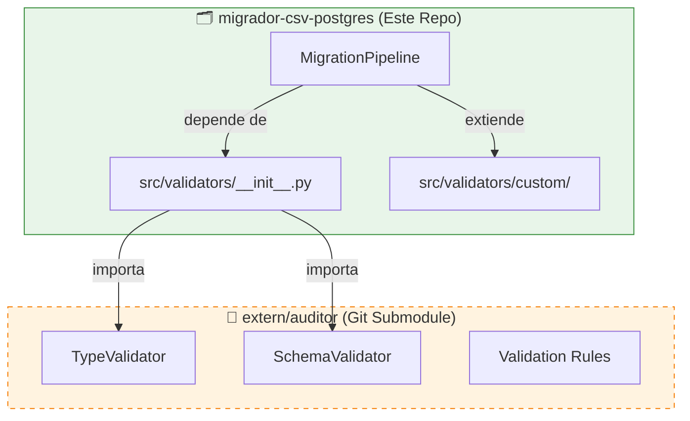

# Estrategia de Reutilización del Auditor

---
metadata:
  tipo_documento: Guía de Integración
  dominio: Arquitectura de Software
  estado: Aprobado
  fecha_creacion: 2026-04-27
  fecha_actualizacion: 2026-04-27
  autor: fisherk2, Arquitecto de Software
  revisores: [Equipo de Desarrollo]
  stakeholders: [Desarrolladores, Arquitectos]
  tags: [git-submodule, reuso, clean-architecture, facade]
  version: 1.0
  relacionado_con: [[ADR.md]], [[src/validators/__init__.py]]
---

## Introducción

Este documento define la estrategia de reutilización del proyecto `auditor-de-calidad-de-datos` mediante `git submodule`. El objetivo es maximizar el reuso de validadores existentes mientras se mantiene aislamiento completo y control de versiones.

**Propósito:**
- Definir límites arquitectónicos entre migrador y auditor
- Documentar contrato de imports vía Facade pattern
- Proporcionar workflow de actualización del submodule
- Guiar extensión sin modificar código original

**Principios Aplicados:**
- **DIP (Dependency Inversion):** Dominio depende de abstracción, no detalle
- **Facade Pattern:** API limpia y estable sobre dependencia externa
- **Read-Only Integration:** Migrador no modifica código del auditor

---

## 🏗️ Límites Arquitectónicos

### Separación de Responsabilidades



### Reglas de Aislamiento

| Regla | Descripción | Aplicación |
|-------|-------------|------------|
| **Read-Only** | Migrador nunca modifica código en `extern/auditor/` | Estricto - violación es error crítico |
| **Facade Only** | Solo `src/validators/__init__.py` importa del auditor | Otros módulos no importan directamente |
| **Custom Extension** | Extensiones en `src/validators/custom/` | Nunca modificar código del auditor |
| **Version Pinning** | Commit SHA explícito en `.gitmodules` | No usar versiones flotantes |

### Qué NO Hacer

❌ **Prohibido:**
- Modificar archivos en `extern/auditor/`
- Importar directamente desde `extern.auditor` fuera del Facade
- Hacer commits en el submodule desde este repo
- Usar `git submodule update --remote` sin revisión
- Copiar código del auditor a `src/` (duplicación)

✅ **Permitido:**
- Leer código del auditor para entender su API
- Fork del auditor para contribuir cambios
- Crear PRs en el repo del auditor
- Extender funcionalidad en `src/validators/custom/`

---

## 📦 Contrato de Imports (Facade Pattern)

### src/validators/__init__.py

Este módulo actúa como **Facade Layer** que expone una API limpia y estable del auditor externo, protegiendo al dominio de cambios en la estructura interna de dependencias externas según Clean Architecture.

#### Estructura del Facade

```python
"""
Facade de Validadores - Boundary Layer para el Migrador CSV.
Expone una API limpia y estable de validaciones del auditor externo.
"""

# ■■■■■■■■■■■■■ Import desde el auditor externo ■■■■■■■■■■■■■
from extern.auditor.src.validators.type_validator import TypeValidator
from extern.auditor.src.validators.schema_validator import (
    load_schema_from_yaml,
    validate_schema_format,
)

# ■■■■■■■■■■■■■ Wrappers para exponer funciones ■■■■■■■■■■■■■
def validate_integer(value: Any) -> tuple[bool, str]:
    """Wrapper para validación de enteros usando TypeValidator del auditor."""
    # Lógica de adaptación aquí

# ■■■■■■■■■■■■■ Validadores custom específicos del dominio ■■■■■■■■■■■■■
from .custom.email_validator import validate_email_format
from .custom.phone_validator import validate_phone_format

# ■■■■■■■■■■■■■ Exportación pública de la API del Facade ■■■■■■■■■■■■■
__all__ = [
    "validate_integer",
    "validate_float", 
    "validate_string",
    "validate_boolean",
    "load_schema_from_yaml",
    "validate_schema_format",
    "validate_email_format",
    "validate_phone_format",
]
```

#### API Pública Exportada

| Función | Origen | Propósito |
|---------|--------|-----------|
| `validate_integer()` | Auditor (wrapper) | Validación de enteros |
| `validate_float()` | Auditor (wrapper) | Validación de flotantes |
| `validate_string()` | Auditor (wrapper) | Validación de strings |
| `validate_boolean()` | Auditor (wrapper) | Validación de booleanos |
| `load_schema_from_yaml()` | Auditor (re-export) | Carga de esquemas YAML |
| `validate_schema_format()` | Auditor (re-export) | Validación de formato de esquema |
| `validate_email_format()` | Custom | Validación de email (RFC 5322) |
| `validate_phone_format()` | Custom | Validación de teléfono |

#### Manejo de Errores

```python
try:
    from extern.auditor.src.validators.type_validator import TypeValidator
except ImportError as e:
    raise ImportError(
        f"No se pudo importar desde extern.auditor. "
        f"Ejecuta: git submodule update --init --recursive\n"
        f"Error original: {e}"
    ) from e
```

**Beneficio:** Mensaje claro cuando el submodule no está inicializado.

---

## 🔄 Flujo de Actualización del Submodule

### Inicialización (Primer Uso)

```bash
# Clonar con submodules
git clone --recurse-submodules https://github.com/Fisherk2/migrator-csv-postgres
cd migrador-csv-postgres

# Si olvidaste --recurse-submodules
git submodule update --init --recursive
```

### Actualización a Versión Específica

```bash
# 1. Navegar al submodule
cd extern/auditor

# 2. Ver estado actual (probablemente detached HEAD)
git status
# Output: HEAD detached at <commit-sha>

# 3. Ver commits disponibles
git log --oneline -10

# 4. Cambiar a versión específica
git checkout <commit-sha>

# 5. Volver al repo principal
cd ../..

# 6. Commit el cambio de versión
git add extern/auditor
git commit -m "Pin auditor to commit <commit-sha>"
```

### Actualización a Última Versión (Cauteloso)

```bash
# 1. Navegar al submodule
cd extern/auditor

# 2. Actualizar a latest
git fetch origin
git checkout origin/main

# 3. Ver cambios (IMPORTANTE)
git log --oneline HEAD@{1}..HEAD

# 4. Volver al repo principal
cd ../..

# 5. Commit el cambio
git add extern/auditor
git commit -m "Update auditor to latest"
```

### Script de Actualización Automatizada

```bash
# scripts/update_submodule.sh
#!/bin/bash
set -e

echo "🔄 Actualizando submodule del auditor..."

cd extern/auditor
git fetch origin
git checkout origin/main
cd ../..

git add extern/auditor
git commit -m "chore: update auditor submodule to latest"

echo "✅ Submodule actualizado exitosamente"
```

---

## 🚫 Manejo de Detached HEAD

### ¿Qué es Detached HEAD?

Cuando un submodule está en `detached HEAD`, significa que no está en una branch sino en un commit específico. Esto es **intencional** y **correcto** para versionado explícito.

```bash
cd extern/auditor
git status
# Output: HEAD detached at abc1234
```

### Cómo Manejarlo

**✅ CORRECTO:**
```bash
# Ver en qué commit estás
git log --oneline -1

# Cambiar a otro commit específico
git checkout <new-commit-sha>
```

**❌ INCORRECTO:**
```bash
# NO hacer commits en detached HEAD
git commit -m "my change"  # Esto creará commits huérfanos

# NO hacer push desde detached HEAD
git push origin HEAD  # Esto fallará
```

### Si Necesitas Hacer Cambios

```bash
# 1. Crear una branch desde el commit actual
cd extern/auditor
git checkout -b my-feature origin/main

# 2. Hacer cambios
# ... editar archivos ...

# 3. Commit y push
git add .
git commit -m "Add new validator"
git push origin my-feature

# 4. Crear PR en el repo del auditor
# (requiere permisos de escritura en el repo original)
```

---

## 🔧 Cómo Extender Sin Modificar el Original

### Estrategia: Custom Validators

Los validadores específicos del dominio del migrador se implementan en `src/validators/custom/`, extendiendo la funcionalidad del auditor sin modificar su código.

#### Estructura de Custom Validators

```
src/validators/custom/
├── __init__.py
├── email_validator.py
└── phone_validator.py
```

#### Ejemplo: Email Validator

```python
# src/validators/custom/email_validator.py
from typing import Tuple, Optional

def validate_email_format(value: str) -> Tuple[bool, str, Optional[str]]:
    """
    Validación de email con RFC 5322 simplificado.
    
    Returns:
        (is_valid, reason, suggestion)
    """
    if not value or "@" not in value:
        return False, "Email inválido: falta @", None
    
    local, domain = value.rsplit("@", 1)
    
    if not local or not domain:
        return False, "Email inválido: formato incorrecto", None
    
    if "." not in domain:
        return False, "Email inválido: dominio sin .", f"{local}@example.com"
    
    return True, "", None
```

#### Integración con el Facade

```python
# src/validators/__init__.py
from .custom.email_validator import validate_email_format
from .custom.phone_validator import validate_phone_format

__all__ = [
    # ... validadores del auditor ...
    "validate_email_format",
    "validate_phone_format",
]
```

### Beneficios de Esta Estrategia

1. **Aislamiento:** Cambios en el auditor no rompen validadores custom
2. **Versionado:** Validadores custom versionados con el migrador
3. **Testing:** Tests de validadores custom independientes del auditor
4. **Contribución:** Si un validador custom es útil, puede contribuirse al auditor

---

## 📋 Workflow Completo de Contribución

### Escenario: Agregar Nuevo Validador al Auditor

**Requisito:** Tienes permisos de escritura en el repo del auditor.

```bash
# 1. Fork del auditor (en GitHub/GitLab)
# (hacer esto una vez)

# 2. Clonar tu fork
git clone https://github.com/tu-usuario/auditor-de-calidad-de-datos
cd auditor-de-calidad-de-datos

# 3. Crear branch de feature
git checkout -b feature/url-validator

# 4. Implementar validador
# ... editar src/validators/url_validator.py ...

# 5. Commit y push
git add .
git commit -m "Add URL validator"
git push origin feature/url-validator

# 6. Crear PR en el repo original
# (en GitHub/GitLab)

# 7. Esperar aprobación y merge

# 8. Actualizar submodule en migrador
cd /ruta/a/migrador-csv-postgres
cd extern/auditor
git fetch origin
git checkout origin/main
cd ../..
git add extern/auditor
git commit -m "Update auditor to include URL validator"
```

### Escenario: Sin Permisos de Escritura

```bash
# 1. Fork del auditor
# 2. Implementar en tu fork
# 3. Crear PR en el repo original
# 4. Esperar aprobación
# 5. Si es rechazada, mantener en tu fork y usar tu fork como submodule
# (cambiar URL en .gitmodules)
```

---

## 🔍 Troubleshooting

### Error: "No module named 'extern.auditor'"

**Causa:** Submodule no inicializado

**Solución:**
```bash
git submodule update --init --recursive
```

### Error: "ImportError: No se pudo importar desde extern.auditor"

**Causa:** Submodule está en commit incorrecto o corrupto

**Solución:**
```bash
cd extern/auditor
git status
# Si está en estado extraño, reset a commit conocido
git checkout <commit-sha>
cd ../..
git add extern/auditor
git commit -m "Fix submodule state"
```

### Error: "fatal: not a git repository"

**Causa:** Directorio `extern/auditor` existe pero no es un git repo

**Solución:**
```bash
rm -rf extern/auditor
git submodule update --init --recursive
```

### Submodule en Estado "Dirty"

**Causa:** Cambios no commiteados en el submodule

**Solución:**
```bash
cd extern/auditor
git status
# Si hay cambios no deseados:
git checkout .
cd ../..
```

---

## 📊 Resumen de Comandos Git Submodule

| Comando | Propósito | Cuándo Usar |
|---------|-----------|-------------|
| `git submodule update --init --recursive` | Inicializar submodules | Primer clon o si faltan |
| `cd extern/auditor && git status` | Ver estado del submodule | Antes de actualizar |
| `cd extern/auditor && git checkout <sha>` | Pin a versión específica | Para reproducibilidad |
| `cd extern/auditor && git checkout origin/main` | Actualizar a latest | Cautelosamente, con revisión |
| `git add extern/auditor && git commit` | Commit cambio de versión | Después de actualizar |
| `git submodule status` | Ver estado de todos los submodules | Para diagnóstico |

---

## 🎯 Checklist de Validación

Antes de commit cambios relacionados con el auditor:

- [ ] No modifiqué archivos en `extern/auditor/`
- [ ] Solo importo del auditor vía `src/validators/__init__.py`
- [ ] Validadores nuevos están en `src/validators/custom/`
- [ ] Commiteé el cambio de versión del submodule si lo actualicé
- [ ] Verifiqué que el submodule no está en estado "dirty"
- [ ] Probé que los imports funcionan después de cambios

---

## 📚 Referencias

- [Git Submodules Documentation](https://git-scm.com/book/en/v2/Git-Tools-Submodules)
- [ADR-MIG-002: Git Submodule vs Pip Package vs Vendor](ADR.md#adr-mig-002-git-submodule-vs-pip-package-vs-vendor)
- [Clean Architecture - Cap. 30: The Database is a Detail](https://blog.cleancoder.com/uncle-bob/2012/08/13/the-clean-architecture.html)

---

> **Nota Importante:** Esta estrategia de reuso maximiza el valor del auditor mientras mantiene aislamiento completo. Siempre prioriza la estabilidad del migrador sobre la última versión del auditor. Versiones pinnadas (commit SHA) son preferibles sobre versiones flotantes para reproducibilidad.