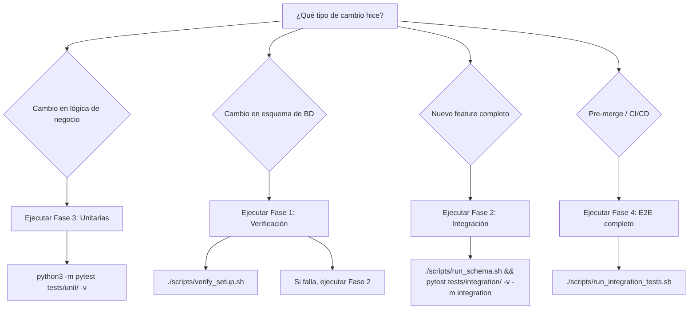

# Estrategia de Pruebas del Proyecto

## Visión General

Este proyecto implementa una **pirámide de testing** escalonada que valida el sistema desde la lógica aislada hasta el comportamiento end-to-end, siguiendo los principios F.I.R.S.T. (*Fast, Independent, Repeatable, Self-validating, Timely*) descritos en *Clean Code* Cap. 9. La arquitectura basada en Clean Architecture (*Clean Architecture* Cap. 20) facilita el aislamiento de componentes mediante inyección de dependencias, permitiendo tests unitarios sin dependencias externas y tests de integración con base de datos real cuando sea necesario.

### Principios Rectores

- **F.I.R.S.T.**: Los tests deben ser rápidos (unitarias <1s), independientes (no dependen del orden de ejecución), repetibles (mismo resultado en cualquier entorno), autovalidantes (pasan/fallan sin interpretación manual) y oportunos (se escriben junto con el código).
- **Aislamiento Transaccional**: Los tests de integración usan ROLLBACK automático para no contaminar la base de datos entre pruebas.
- **YAGNI en Infraestructura**: No construir orquestadores complejos si scripts simples resuelven el problema. Las 4 fases existentes cubren todos los escenarios de desarrollo y CI/CD.

### Mapa Mental de Decisión



## Las 4 Fases de Ejecución

| Fase | Comando | Propósito | Dependencias | Tiempo Estimado | Cuándo Usar |
|------|---------|-----------|--------------|-----------------|-------------|
| 1. Verificación de entorno | `./scripts/verify_setup.sh` | Validar integridad de BD y contenedor | Docker, .env | <2 min | Antes de cualquier prueba o tras cambios en infraestructura |
| 2. Integración con pytest | `./scripts/run_schema.sh && pytest tests/integration/ -v -m integration` | Validar interacción de componentes con BD real | Docker, pytest, BD activa | 5-10 min | Desarrollo iterativo de componentes de migración |
| 3. Unitarias con mocks | `python3 -m pytest tests/unit/ -v` | Validar lógica aislada sin dependencias externas | Python, pytest | <1 min | Desarrollo rápido, TDD, refactorización |
| 4. E2E autónomo | `./scripts/run_integration_tests.sh` | Validación completa end-to-end con limpieza automática | Docker, Python, .env | 10-15 min | Pre-merge, CI/CD, validación final antes de release |

## Detalle de Cada Fase

### Fase 1: Verificación de Entorno

**Comando:** `./scripts/verify_setup.sh`

**Qué Verifica:**
- Contenedor Docker `migrator_postgres_dev` está corriendo
- PostgreSQL está aceptando conexiones en puerto 5433
- Base de datos `migrator_ecommerce` existe con esquema completo
- Constraints y triggers funcionan correctamente
- Operaciones CRUD básicas (INSERT, SELECT, UPDATE, DELETE) con ROLLBACK

**Qué Hace Si Falla:**
- Ejecuta cleanup completo (detiene contenedor, elimina volúmenes)
- Elimina imagen PostgreSQL para liberar espacio
- Retorna código de error para que CI/CD falle explícitamente

**Cómo Interpretar Output:**
- `[SUCCESS]` con "Tests unitarios ejecutados exitosamente" → Entorno válido
- `[ERROR]` con mensajes de conexión → Revisar Docker y puertos
- `[WARNING]` con "No hay imágenes huérfanas" → Normal, no requiere acción

**Qué Hacer Ahora:** Ejecutar Fase 3 (unitarias) si el entorno es válido. Si falla, revisar Docker Desktop y reiniciar contenedor.

---

### Fase 2: Integración con Pytest

**Comando:** `./scripts/run_schema.sh && pytest tests/integration/ -v -m integration`

**Cuándo Elegir Pytest Integration Sobre Script E2E:**
- Desarrollo iterativo de un componente específico (ej: `DBConnector`, `CSVLoader`)
- Necesitas usar fixtures de pytest (`@pytest.fixture`) para setup/teardown
- Quieres ejecutar solo un subset de tests (ej: `pytest tests/integration/test_db_connector.py -v`)
- Estás debuggeando un componente y necesitas granularidad en el output

**Cómo Aislar Tests con `@pytest.mark.integration`:**
```python
import pytest

@pytest.mark.integration
def test_db_connection_with_real_database(test_db_config):
    """Test que requiere BD real."""
    # Este test solo se ejecuta con -m integration
    pass

def test_pure_logic():
    """Test unitario que no requiere BD."""
    # Este test se ejecuta siempre
    pass
```

**Dependencias:**
- Docker corriendo con PostgreSQL
- Base de datos `migrator_ecommerce` creada (ejecuta `run_schema.sh` primero)
- Variables de entorno en `.env` (DB_HOST, DB_PORT, DB_USER, DB_PASSWORD, DB_NAME)

**Qué Hacer Ahora:** Si pasan todos los tests marcados con `@pytest.mark.integration`, el componente funciona correctamente con BD real. Si fallan, revisa logs de PostgreSQL y validaciones de esquema.

---

### Fase 3: Unitarias con Mocks

**Comando:** `python3 -m pytest tests/unit/ -v`

**Módulos Cubiertos:**
- `test_error_handler.py`: Manejo de errores, acumulación, exportación
- `test_validators_reuse.py`: Funciones importadas de submódulo (email, phone, integer, string)
- `test_csv_loader.py` (unit): Lógica de validación sin conexión a BD
- `test_db_connector.py` (unit): Gestión de conexiones sin PostgreSQL real

**Cómo Añadir Nuevos Tests Siguiendo F.I.R.S.T.:**

```python
import pytest
from src.migrator.csv_loader import CSVLoader

def test_csv_loader_validation_logic():
    """
    Test de lógica de validación aislado.
    - Fast: No requiere BD, ejecuta en <100ms
    - Independent: No depende de otros tests
    - Repeatable: Mismo resultado siempre
    - Self-validating: Assert claro sin ambigüedad
    - Timely: Se escribe junto con el código
    """
    # Given
    loader = CSVLoader()
    schema = {
        'columns': {
            'email': {'type': 'email', 'required': True}
        }
    }
    
    # When
    result = loader._validate_field('email', 'invalid-email', schema['columns']['email'])
    
    # Then
    assert result.is_valid is False
    assert 'formato inválido' in result.error_message
```

**Naming Convention:**
- Archivo: `test_<modulo>.py`
- Función: `test_<funcionalidad_específica>`
- Clase de tests: `Test<NombreDelComponente>`

**Asserts Recomendados:**
- Usar `assert` directo (no `assertTrue`, `assertFalse`)
- Un assert por concepto (no múltiples asserts en una línea)
- Mensajes descriptivos en asserts complejos: `assert value == expected, f"Expected {expected}, got {value}"`

**Qué Hacer Ahora:** Si todas las unit tests pasan, la lógica de negocio es correcta. Si fallan, revisa el código del componente modificado.

---

### Fase 4: E2E Autónomo

**Comando:** `./scripts/run_integration_tests.sh --verbose`

**Flujo Interno:**

1. **Setup:**
   - Verifica prerequisitos (Docker, Python, .env)
   - Carga configuración de tests desde `.env` (variables `TEST_*`)
   - Asegura contenedor corriendo (lo inicia si está detenido)
   - Espera a que PostgreSQL esté listo (`pg_isready`)

2. **Fixtures:**
   - Crea base de datos `migrator_test` con `init_db.py --drop migrator_test`
   - Aplica esquema completo (02_create_schema.sql, 03_create_indexes.sql)
   - Exporta variables `TEST_DB_HOST`, `TEST_DB_PORT`, `TEST_DB_NAME`, `TEST_DB_USER`, `TEST_DB_PASSWORD`

3. **Ejecución:**
   - Ejecuta `tests/test_integration.py` con flags `--verbose` si se especifica
   - Procesa CSVs de `tests/fixtures/` (customers_valid.csv, customers_invalid_email.csv, etc.)
   - Valida resultados contra expectativas (importadas, rechazadas)

4. **Validación:**
   - Verifica que cada test individual pase
   - Calcula totales (importadas, rechazadas)
   - Retorna código de error si algún test falla

5. **Cleanup:**
   - Elimina base de datos `migrator_test` (si no se usa `--keep-data`)
   - Retorna código 0 si todos los tests pasaron, 1 si fallaron

**Por Qué Es el "Gold Standard" para CI/CD:**
- **Autónomo**: No requiere setup manual previo
- **Idempotente**: Puede ejecutarse múltiples veces sin efectos secundarios
- **Completo**: Valida todo el flujo desde CSV hasta BD
- **Limpio**: Elimina base de datos de prueba automáticamente
- **Determinista**: Mismo resultado en cada ejecución

**Qué Hacer Ahora:** Si el script retorna código 0 y muestra "🎉 PRUEBAS DE INTEGRACIÓN PASARON", el sistema está listo para merge. Si falla, revisa logs detallados con `--verbose`.

---

## Guía de Solución de Problemas

### Matriz de Troubleshooting

| Síntoma | Fase Afectada | Causa Probable | Comando de Diagnóstico | Solución |
|---------|--------------|----------------|------------------------|----------|
| `Submodule 'extern/validators' not initialized` | Todas | Submodule Git no clonado | `git submodule status` | `git submodule update --init --recursive` |
| `Connection refused` en puerto 5433 | Fase 1, 2, 4 | Contenedor Docker no corriendo | `docker ps -a` | `docker-compose up -d` |
| `port 5432 already in use` | Fase 1, 2, 4 | Otro servicio PostgreSQL corriendo | `lsof -i :5432` | Cambiar puerto en `docker-compose.yml` o detener servicio |
| `TEST_DB_NAME colisiona con producción` | Fase 2, 4 | Variables de entorno mal configuradas | `echo $TEST_DB_NAME` | Usar `TEST_DB_NAME=migrator_test` en `.env` |
| `Fixture CSV con headers desactualizados` | Fase 4 | Schema YAML cambió pero CSV no | `head -1 tests/fixtures/customers_valid.csv` vs `config/schema_examples/customers_schema.yaml` | Actualizar CSV para coincidir con schema |
| `ModuleNotFoundError: No module named 'src'` | Fase 3 | PYTHONPATH no configurado | `echo $PYTHONPATH` | Ejecutar desde raíz del proyecto o agregar `export PYTHONPATH="${PYTHONPATH}:$(pwd)/src"` |
| `psycopg2.OperationalError: FATAL: password authentication failed` | Fase 2, 4 | Credenciales incorrectas en .env | `cat .env \| grep DB_PASSWORD` | Verificar que `DB_PASSWORD` coincida con `docker-compose.yml` |
| `pytest: command not found` | Fase 2, 3 | Entorno virtual no activado | `which pytest` | Activar venv: `source .venv/bin/activate` |

### Escenarios Comunes

**Escenario 1: Tests de Integración Fallan con "Database not found"**
- **Diagnóstico:** Base de datos `migrator_ecommerce` no existe
- **Solución:** Ejecutar `./scripts/run_schema.sh` antes de `pytest tests/integration/`

**Escenario 2: Tests Unitarias Fallan con "ImportError"**
- **Diagnóstico:** Módulo no encontrado en PYTHONPATH
- **Solución:** Ejecutar desde raíz del proyecto o instalar en modo desarrollo: `pip install -e .`

**Escenario 3: E2E Tests Fallan con "Schema no encontrado"**
- **Diagnóstico:** Rutas relativas incorrectas en `test_integration.py`
- **Solución:** Verificar que `Path(__file__).parent.parent / 'config'` apunte al directorio correcto

**Escenario 4: Tests Flaky (Pasan/Fallan Intermittently)**
- **Diagnóstico:** Tests no independientes o dependen del orden de ejecución
- **Solución:** Revisar que cada test cree y limpie sus propios datos, usar fixtures de pytest

**Escenario 5: Docker Container No Inicia**
- **Diagnóstico:** Puerto en uso o volumen corrupto
- **Solución:** `docker-compose down -v` para limpiar volúmenes, luego `docker-compose up -d`

---

## Extensión y Mantenimiento

### Cómo Añadir un Nuevo Test Unitario

**Plantilla Mínima:**

```python
import pytest
from src.migrator.<modulo> import <ClaseOFuncion>

def test_<funcionalidad_específica>():
    """
    Descripción breve de qué se prueba.
    
    Contexto: Cuándo es relevante este test.
    """
    # Given: Configuración del test
    sut = <ClaseOFuncion>(parametros)
    
    # When: Acción a probar
    resultado = sut.metodo_a_probar()
    
    # Then: Verificación
    assert resultado == esperado, f"Expected {esperado}, got {resultado}"
```

**Pasos:**
1. Crear archivo `tests/unit/test_<nuevo_modulo>.py`
2. Importar el componente a probar desde `src.migrator`
3. Escribir test siguiendo patrón Given-When-Then
4. Ejecutar: `python3 -m pytest tests/unit/test_<nuevo_modulo>.py -v`
5. Validar que pase y agregue al contador de tests

---

### Cómo Añadir un Nuevo Test de Integración

**Requisitos:**
- Aislamiento transaccional: Cada test debe hacer ROLLBACK
- Fixtures necesarias: `test_db_config` para conexión, `db_connection` para sesión
- Marca `@pytest.mark.integration` para filtrar ejecución

**Plantilla:**

```python
import pytest
from src.migrator.db_connector import DBConnector

@pytest.mark.integration
def test_<funcionalidad_con_bd>(test_db_config, db_connection):
    """
    Test que requiere base de datos real.
    Usa db_connection fixture que hace ROLLBACK automático.
    """
    # Given: Configuración con BD real
    connector = DBConnector(test_db_config)
    
    # When: Operación que afecta BD
    cursor = db_connection.cursor()
    cursor.execute("INSERT INTO customers (name, email) VALUES (%s, %s)", ("Test", "test@example.com"))
    
    # Then: Verificación (ROLLBACK automático al final)
    cursor.execute("SELECT COUNT(*) FROM customers WHERE name = 'Test'")
    count = cursor.fetchone()[0]
    assert count == 1
```

**Pasos:**
1. Crear archivo `tests/integration/test_<nuevo_componente>.py`
2. Usar fixtures de `conftest.py` (`test_db_config`, `db_connection`)
3. Marcar con `@pytest.mark.integration`
4. Ejecutar: `pytest tests/integration/test_<nuevo_componente>.py -v -m integration`
5. Validar que pase y no contamine BD entre ejecuciones

---

### Cómo Actualizar la Estrategía Cuando el Proyecto Escale

**Añadir Tests de Carga:**
- Herramienta recomendada: `locust` o `k6`
- Script en `tests/load/` para simular carga de migraciones masivas
- Ejecutar en ambiente de staging (no producción)

**Parallel Execution:**
- Pytest soporta paralelismo con `pytest-xdist`
- Ejecutar: `pytest -n auto tests/unit/` para unitarias en paralelo
- Para integración: `pytest -n 2 tests/integration/ -m integration` (limitar a 2 workers para no saturar BD)

**Tests de Regresión Visual:**
- Si el proyecto tiene UI, añadir Playwright o Cypress
- Ubicar en `tests/e2e/` separado de tests de integración de BD

**Tests de Seguridad:**
- Añadir `bandit` para escaneo de vulnerabilidades en código Python
- Ejecutar: `bandit -r src/`

**Monitoreo de Coverage:**
- Ejecutar con coverage: `pytest --cov=src --cov-report=html tests/unit/`
- Objetivo: >80% coverage en módulos críticos

---

## Aplicación del Principio de Responsabilidad Única (SRP) en Testing

Esta estrategia aplica SRP separando claramente las responsabilidades de cada tipo de test:

- **Unitarias (Fase 3):** Responsabilidad única = validar lógica de un componente en aislamiento. No dependen de BD, red, ni otros componentes. Esto facilita refactorización porque cambios en un componente solo afectan sus unit tests.

- **Integración (Fase 2):** Responsabilidad única = validar interacción entre componentes específicos y BD. No prueban toda la aplicación, solo el flujo de un componente (ej: CSVLoader + PostgreSQL).

- **E2E (Fase 4):** Responsabilidad única = validar el sistema completo desde la perspectiva del usuario (CSV → BD). No prueban implementación interna, solo comportamiento observable.

Esta separación permite que el proyecto evolucione sin romper tests existentes: si cambias la lógica de validación, solo afectas unitarias. Si cambias el esquema de BD, solo afectas tests de integración. Si cambias el flujo completo, afectas E2E. Sin SRP, un cambio pequeño podría romper múltiples tipos de tests, creando fricción innecesaria en el desarrollo.

---

## Validación

Para validar que esta estrategia funciona correctamente:

1. **Ejecutar todas las fases en orden:**
   ```bash
   ./scripts/verify_setup.sh
   python3 -m pytest tests/unit/ -v
   ./scripts/run_schema.sh && pytest tests/integration/ -v -m integration
   ./scripts/run_integration_tests.sh --verbose
   ```

2. **Verificar que cada fase retorne código 0.**

3. **Revisar que el total de tests coincida:**
   - Unitarias: 83 tests
   - Integración pytest: N tests marcados con `@pytest.mark.integration`
   - E2E: 4 tests (customers_valid, invalid_email, invalid_phone, mixed)

4. **Validar que no haya tests flaky:** Ejecutar cada fase 3 veces consecutivas y verificar mismo resultado.

---

## Referencias Bibliográficas

- **F.I.R.S.T. Principles:** *Clean Code* Cap. 9 - Robert C. Martin
- **Arquitectura Testable:** *Clean Architecture* Cap. 20 - Robert C. Martin
- **Fases de Testing en SDLC:** *Systems Analysis & Design* Cap. 11
- **TDD y Unit Testing:** *Software Development, Design, and Coding* Cap. 18
- **Pirámide de Testing:** *The Art of Unit Testing* - Roy Osherove
