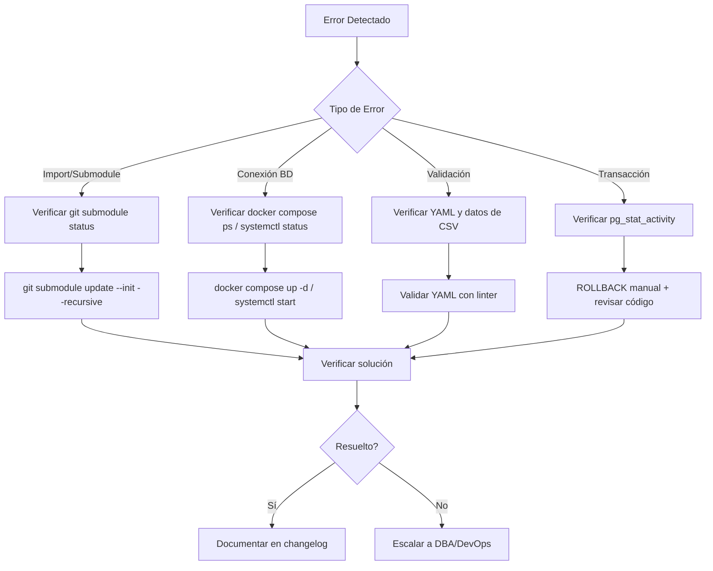

# Troubleshooting - Migrador CSV PostgreSQL

---
metadata:
  tipo_documento: Guía de Diagnóstico
  dominio: Operaciones y Resolución de Problemas
  estado: Aprobado
  fecha_creacion: 2026-04-27
  fecha_actualizacion: 2026-04-27
  autor: fisherk2, SRE/DevOps Expert
  revisores: [Equipo de DevOps, Equipo QA]
  stakeholders: [Desarrolladores, DBAs, Equipo Soporte]
  tags: [troubleshooting, errores, diagnóstico, postgresql]
  version: 1.0
  relacionado_con: [[POSTGRES_SETUP.md]], [[ADR.md]], [[REUSE_STRATEGY.md]]
---

## Introducción

Este documento proporciona una matriz accionable de errores comunes en el Migrador CSV, con diagnóstico sistemático y soluciones probadas. Según *Software Development, Design, and Coding* (Cap. 19), el troubleshooting debe ser sistemático y reproducible para reducir el MTTR (Mean Time To Recovery).

**Propósito:**
- Diagnosticar errores comunes rápidamente
- Proporcionar soluciones reproducibles
- Documentar prevención de errores recurrentes
- Facilitar escalación cuando es necesario

**Metodología:**
Cada error sigue el formato: **Síntoma → Causa → Diagnóstico → Solución → Prevención**

---

## 📋 Matriz de Errores

### Categoría 1: Submodule y Dependencias

| Síntoma | Causa Raíz | Comando de Diagnóstico | Solución | Prevención |
|---------|-----------|------------------------|----------|------------|
| `ModuleNotFoundError: No module named 'extern.auditor'` | Submodule git no inicializado | `git submodule status`<br>`ls -la extern/auditor` | `git submodule update --init --recursive` | Agregar verificación en CI/CD<br>Documentar en onboarding |
| `ImportError: cannot import name 'TypeValidator'` | Submodule en commit incorrecto o corrupto | `cd extern/auditor && git status`<br>`cd extern/auditor && git log --oneline -1` | `cd extern/auditor && git checkout <commit-sha>`<br>`cd ../.. && git add extern/auditor` | Usar `scripts/update_submodule.sh`<br>Pinning a commit SHA específico |
| `Permission denied (publickey)` al hacer push al submodule | No tienes permisos de escritura en repo original | `git remote -v`<br>`cd extern/auditor && git remote -v` | Fork del repo original<br>Actualizar `.gitmodules` con URL de fork | Documentar workflow de contribución<br>Usar PRs en lugar de push directo |

### Categoría 2: Configuración y Variables de Entorno

| Síntoma | Causa Raíz | Comando de Diagnóstico | Solución | Prevención |
|---------|-----------|------------------------|----------|------------|
| `FileNotFoundError: .env` | Archivo `.env` no existe | `ls -la .env`<br>`cat .env.example` | `cp .env.example .env`<br>Editar `.env` con credenciales reales | Agregar `.env` a `.gitignore`<br>Verificar en CI/CD |
| `KeyError: 'DB_HOST'` | Variable de entorno faltante en `.env` | `cat .env \| grep DB_HOST`<br>`python -c "import os; print(os.environ.get('DB_HOST'))"` | Agregar `DB_HOST=localhost` a `.env`<br>Reiniciar aplicación | Validar variables en startup<br>Usar valores por defecto en código |
| `psycopg2.OperationalError: FATAL: password authentication failed` | Contraseña incorrecta en `.env` | `PGPASSWORD="tu_pass" psql -h localhost -U migrator_user -d migrator_ecommerce -c "SELECT 1;"` | Verificar contraseña en `.env`<br>Reiniciar PostgreSQL si cambió | Usar secretos management en producción<br>Rotación de contraseñas documentada |
| `psycopg2.OperationalError: FATAL: database "migrator_ecommerce" does not exist` | Base de datos no creada | `psql -h localhost -U postgres -c "\l"`<br>`psql -h localhost -U postgres -c "SELECT datname FROM pg_database;"` | Ejecutar `scripts/sql/01_create_database.sql`<br>Usar `scripts/run_schema.sh` | Automatizar creación en setup<br>Verificar en healthcheck |

### Categoría 3: Conexión a PostgreSQL

| Síntoma | Causa Raíz | Comando de Diagnóstico | Solución | Prevención |
|---------|-----------|------------------------|----------|------------|
| `psycopg2.OperationalError: could not connect to server: Connection refused` | PostgreSQL no iniciado o puerto incorrecto | `docker compose ps`<br>`sudo systemctl status postgresql`<br>`netstat -tuln \| grep 5432` | `docker compose up -d`<br>`sudo systemctl start postgresql`<br>Verificar `DB_PORT` en `.env` | Healthcheck en startup<br>Monitoreo de servicio |
| `psycopg2.OperationalError: timeout expired` | PostgreSQL no responde (lock o alta carga) | `docker exec migrator_postgres_dev psql -U migrator_user -d migrator_ecommerce -c "SELECT pg_stat_activity;"` | Identificar query bloqueante<br>`SELECT pg_terminate_backend(pid)`<br>Reiniciar PostgreSQL si es necesario | Monitoreo de locks<br>Timeouts configurados en aplicación |
| `psycopg2.OperationalError: server closed the connection unexpectedly` | PostgreSQL reiniciado o crash | `docker logs migrator_postgres_dev --tail 50`<br>`sudo journalctl -u postgresql` | Verificar logs de crash<br>Reiniciar PostgreSQL<br>Verificar recursos (RAM/CPU) | Monitoreo de recursos<br>Alertas de crash |
| `psycopg2.InterfaceError: connection already closed` | Conexión cerrada por timeout de inactividad | `psql -h localhost -U migrator_user -d migrator_ecommerce -c "SHOW idle_in_transaction_session_timeout;"` | Configurar pool de conexiones con keepalive<br>Aumentar `idle_in_transaction_session_timeout` | Usar connection pooling<br>Retry automático en aplicación |

### Categoría 4: Validación y Esquema

| Síntoma | Causa Raíz | Comando de Diagnóstico | Solución | Prevención |
|---------|-----------|------------------------|----------|------------|
| `ValidationError: Invalid email format` | Email no cumple RFC 5322 básico | `python -c "import re; print(re.match(r'[^@]+@[^@]+\.[^@]+', 'test@example.com'))"` | Validar CSV antes de migración<br>Usar modo `permissive` en config | Pre-validación de CSV<br>Documentar reglas de validación |
| `YAMLError: mapping values are not allowed here` | Sintaxis incorrecta en YAML | `python -c "import yaml; yaml.safe_load(open('config/default_migration.yaml'))"` | Validar YAML con linter<br>Verificar indentación (2 espacios) | CI/CD con validación de YAML<br>Pre-commit hooks |
| `psycopg2.ProgrammingError: relation "customers" does not exist` | Tabla no creada (script SQL no ejecutado) | `psql -h localhost -U migrator_user -d migrator_ecommerce -c "\dt"` | Ejecutar `scripts/sql/02_create_schema.sql`<br>Usar `scripts/run_schema.sh` | Automatizar migraciones en setup<br>Tests de integración |
| `psycopg2.IntegrityError: duplicate key value violates unique constraint "customers_email_key"` | Email duplicado en CSV | `psql -h localhost -U migrator_user -d migrator_ecommerce -c "SELECT email, COUNT(*) FROM customers GROUP BY email HAVING COUNT(*) > 1;"` | Configurar `duplicate_handling: skip` en YAML<br>Limpiar duplicados en CSV | Validación de unicidad antes de migración<br>Índices únicos en BD |

### Categoría 5: Transacciones y Rollback

| Síntoma | Causa Raíz | Comando de Diagnóstico | Solución | Prevención |
|---------|-----------|------------------------|----------|------------|
| `psycopg2.OperationalError: current transaction is aborted, commands ignored until end of transaction block` | Error en transacción no manejado | `psql -h localhost -U migrator_user -d migrator_ecommerce -c "SELECT pg_stat_activity WHERE state = 'idle in transaction';"` | Ejecutar `ROLLBACK` manual<br>Verificar código de manejo de errores | Try-except con rollback explícito<br>Tests de rollback |
| `psycopg2.IntegrityError: insert or update on table "orders" violates foreign key constraint "fk_orders_customer"` | customer_id no existe en tabla customers | `psql -h localhost -U migrator_user -d migrator_ecommerce -c "SELECT customer_id FROM orders WHERE customer_id NOT IN (SELECT id FROM customers);"` | Validar referencias antes de insertar<br>Usar `ON DELETE RESTRICT` apropiadamente | Validación de FK en aplicación<br>Tests de integridad referencial |
| `psycopg2.OperationalError: deadlock detected` | Dos transacciones esperando recursos mutuamente | `psql -h localhost -U migrator_user -d migrator_ecommerce -c "SELECT * FROM pg_stat_activity WHERE wait_event_type = 'Lock';"` | Identificar y matar una de las transacciones<br>Reordenar operaciones | Orden consistente de locks<br>Timeout de deadlock |
| `TransactionRollbackError: Max errors exceeded (50)` | Umbral de errores en validación superado | Verificar logs de migración<br>`grep "ERROR" reports/migration_*.json` | Aumentar `max_errors_before_rollback` en config<br>Corregir datos de origen | Validación incremental<br>Tests de umbral de errores |

### Categoría 6: Scripts de Pruebas y Testing

| Síntoma | Causa Raíz | Comando de Diagnóstico | Solución | Prevención |
|---------|-----------|------------------------|----------|------------|
| `run_integration_tests.sh` exit code 1 con "TODAS LAS PRUEBAS PASARON" | TESTS_FAILED no se resetea correctamente | `echo $?` después de ejecutar script<br>Verificar lógica de contadores en script | Revisar lógica de contadores en run_integration_tests.sh<br>Asegurar reset de TESTS_FAILED antes de ejecutar | Tests unitarios de scripts de orquestación |
| `pytest tests/integration/ -v -m integration` marca tests como skipped | Decorador `@pytest.mark.integration` no aplicado | `grep -r "@pytest.mark.integration" tests/integration/`<br>`pytest --collect-only tests/integration/` | Agregar `@pytest.mark.integration` a tests de integración<br>Verificar configuración en pytest.ini | Documentar uso de markers en guías de testing |
| `verify_setup.sh` falla con "Container not running" | Contenedor Docker detenido o nombre incorrecto | `docker ps -a`<br>`docker inspect migrator_postgres_dev` | `docker compose up -d`<br>Verificar nombre de contenedor en docker-compose.yml | Healthcheck en verify_setup.sh |
| `test_integration.py` no encuentra schema YAML | Rutas relativas incorrectas | `python -c "from pathlib import Path; print(Path(__file__).parent.parent / 'config')"` | Corregir rutas relativas en test_integration.py<br>Usar Path(__file__).parent.parent / 'config' | Tests de path resolution |
| `run_schema.sh` falla con "Database already exists" | Base de datos de prueba ya existe | `psql -h localhost -U postgres -c "\l"`<br>`docker exec migrator_postgres_dev psql -U postgres -c "\l"` | Usar `scripts/init_db.py --drop migrator_test`<br>Limpiar base de datos antes de ejecutar | Cleanup automático en scripts |

### Categoría 7: Permisos y Seguridad

| Síntoma | Causa Raíz | Comando de Diagnóstico | Solución | Prevención |
|---------|-----------|------------------------|----------|------------|
| `psycopg2.OperationalError: permission denied for table customers` | Usuario sin permisos SELECT/INSERT | `psql -h localhost -U postgres -c "\dp migrator_ecommerce.public.customers"` | `GRANT ALL PRIVILEGES ON TABLE customers TO migrator_user;`<br>`GRANT ALL PRIVILEGES ON DATABASE migrator_ecommerce TO migrator_user;` | Configurar permisos en setup<br>Tests de permisos |
| `psycopg2.OperationalError: must be owner of table customers` | Intento de DROP sin ser owner | `psql -h localhost -U postgres -c "SELECT tableowner FROM pg_tables WHERE tablename = 'customers';"` | Ejecutar como usuario owner (postgres)<br>Usar `DROP OWNED BY` si es necesario | Separar roles de aplicación y administración<br>Documentar owners |
| `FATAL: no pg_hba.conf entry for host` | Configuración de autenticación incorrecta | `cat /etc/postgresql/15/main/pg_hba.conf`<br>`psql -h localhost -U postgres -c "SHOW hba_file;"` | Agregar línea `host migrator_ecommerce migrator_user 127.0.0.1/32 md5`<br>`sudo systemctl reload postgresql` | Documentar configuración de pg_hba.conf<br>Usar autenticación trust solo en desarrollo |

---

## 🔍 Diagnóstico Sistemático

### Flujo de Diagnóstico



### Comandos de Diagnóstico Esenciales

```bash
# 1. Verificar estado de submodules
git submodule status
git submodule foreach git status

# 2. Verificar contenedores Docker
docker compose ps
docker compose logs postgres --tail 50

# 3. Verificar conexión PostgreSQL
PGPASSWORD="$DB_PASSWORD" psql -h "$DB_HOST" -p "$DB_PORT" -U "$DB_USER" -d "$DB_NAME" -c "SELECT 1;"

# 4. Verificar tablas y constraints
PGPASSWORD="$DB_PASSWORD" psql -h "$DB_HOST" -p "$DB_PORT" -U "$DB_USER" -d "$DB_NAME" -c "\dt"
PGPASSWORD="$DB_PASSWORD" psql -h "$DB_HOST" -p "$DB_PORT" -U "$DB_USER" -d "$DB_NAME" -c "\d+ orders"

# 5. Verificar locks y transacciones activas
PGPASSWORD="$DB_PASSWORD" psql -h "$DB_HOST" -p "$DB_PORT" -U "$DB_USER" -d "$DB_NAME" -c "SELECT * FROM pg_stat_activity WHERE state = 'idle in transaction';"

# 6. Verificar permisos
PGPASSWORD="$DB_PASSWORD" psql -h "$DB_HOST" -p "$DB_PORT" -U "$DB_USER" -d "$DB_NAME" -c "\dp"

# 7. Verificar tamaño de BD
PGPASSWORD="$DB_PASSWORD" psql -h "$DB_HOST" -p "$DB_PORT" -U "$DB_USER" -d "$DB_NAME" -c "SELECT pg_size_pretty(pg_database_size('$DB_NAME'));"
```

---

## 🚨 Escalación

### Cuándo Escalar

Escalar a DBA Senior o DevOps cuando:
1. **Deadlocks recurrentes:** Más de 3 deadlocks en 1 hora
2. **Performance degradado:** Queries >10s consistentemente
3. **Corrupción de datos:** `psycopg2.DataError` o `psycopg2.InternalError`
4. **Recursos agotados:** RAM/CPU al 90%+ por >5 min
5. **Errores de autenticación:** Permisos no pueden ser resueltos con GRANT estándar

### Información para Escalación

Al escalar, proporcionar:
```bash
# Versión de PostgreSQL
psql --version

# Estado del contenedor/servicio
docker compose ps
# o
sudo systemctl status postgresql

# Logs recientes
docker logs migrator_postgres_dev --tail 100
# o
sudo journalctl -u postgresql -n 100

# Conexiones activas
PGPASSWORD="$DB_PASSWORD" psql -h "$DB_HOST" -p "$DB_PORT" -U "$DB_USER" -d "$DB_NAME" -c "SELECT count(*) FROM pg_stat_activity;"

# Locks activos
PGPASSWORD="$DB_PASSWORD" psql -h "$DB_HOST" -p "$DB_PORT" -U "$DB_USER" -d "$DB_NAME" -c "SELECT * FROM pg_locks WHERE NOT granted;"

# Tamaño de tablas
PGPASSWORD="$DB_PASSWORD" psql -h "$DB_HOST" -p "$DB_PORT" -U "$DB_USER" -d "$DB_NAME" -c "SELECT schemaname, tablename, pg_size_pretty(pg_total_relation_size(schemaname||'.'||tablename)) FROM pg_tables WHERE schemaname = 'public';"
```

---

## 📊 Métricas de Monitoreo

### Métricas Clave

| Métrica | Comando de Obtención | Umbral de Alerta |
|---------|---------------------|------------------|
| Conexiones activas | `SELECT count(*) FROM pg_stat_activity;` | >80% de max_connections |
| Transacciones idle | `SELECT count(*) FROM pg_stat_activity WHERE state = 'idle in transaction';` | >5 |
| Locks esperando | `SELECT count(*) FROM pg_locks WHERE NOT granted;` | >0 |
| Tamaño de BD | `SELECT pg_size_pretty(pg_database_size('$DB_NAME'));` | >80% de allocated |
| Query lento (>1s) | `SELECT * FROM pg_stat_statements WHERE mean_exec_time > 1000;` | >10 queries/min |

### Configuración de Monitoreo

```bash
# Habilitar pg_stat_statements (requiere restart)
PGPASSWORD="$DB_PASSWORD" psql -h "$DB_HOST" -p "$DB_PORT" -U postgres -c "CREATE EXTENSION IF NOT EXISTS pg_stat_statements;"

# Ver queries más lentos
PGPASSWORD="$DB_PASSWORD" psql -h "$DB_HOST" -p "$DB_PORT" -U "$DB_USER" -d "$DB_NAME" -c "SELECT query, mean_exec_time, calls FROM pg_stat_statements ORDER BY mean_exec_time DESC LIMIT 10;"
```

---

## 🛡️ Prevención de Errores

### Checklist de Pre-Deployment

Antes de ejecutar migración en producción:

- [ ] Submodule inicializado y en commit SHA correcto
- [ ] Archivo `.env` configurado con credenciales de producción
- [ ] PostgreSQL iniciado y healthcheck passing
- [ ] Scripts SQL ejecutados en orden correcto
- [ ] CSV validado con schema YAML
- [ ] Tests de integración pasando
- [ ] Backup de base de datos realizado
- [ ] Rollback plan documentado

### Automatización de Prevención

```bash
# Script de pre-flight check
#!/bin/bash
set -e

echo "🔍 Pre-flight check..."

# 1. Verificar submodule
if ! git submodule status | grep -q "^ "; then
    echo "❌ Submodule no inicializado"
    exit 1
fi

# 2. Verificar .env
if [[ ! -f .env ]]; then
    echo "❌ Archivo .env no encontrado"
    exit 1
fi

# 3. Verificar PostgreSQL
if ! docker compose ps | grep -q "Up (healthy)"; then
    echo "❌ PostgreSQL no healthy"
    exit 1
fi

# 4. Verificar tablas
if ! PGPASSWORD="$DB_PASSWORD" psql -h "$DB_HOST" -p "$DB_PORT" -U "$DB_USER" -d "$DB_NAME" -c "\dt" | grep -q "customers"; then
    echo "❌ Tabla customers no existe"
    exit 1
fi

echo "✅ Pre-flight check passed"
```

---

## 📚 Referencias

- [PostgreSQL Error Codes](https://www.postgresql.org/docs/15/errcodes-appendix.html)
- [psycopg2 Documentation](https://www.psycopg.org/docs/)
- [Docker Troubleshooting](https://docs.docker.com/engine/troubleshooting/)
- [REUSE_STRATEGY.md](REUSE_STRATEGY.md) - Para errores de submodule
- [POSTGRES_SETUP.md](POSTGRES_SETUP.md) - Para errores de configuración

---

> **Nota:** Si encuentras un error no documentado aquí, agrégalo a la matriz con diagnóstico y solución para beneficio del equipo. La documentación viva reduce el MTTR para todos.